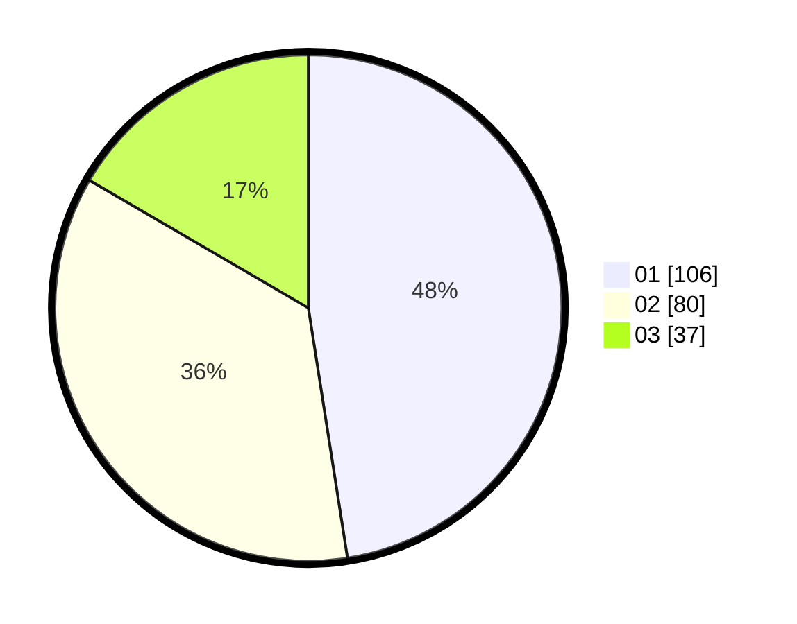

# Hasil

Hasil perolehan suara paslon dapat dilihat pada file paslon-01.txt, paslon-02.txt, dan paslon-03.txt.

Jika tidak ada, artinya data tersebut belum ada pada SIREKAP.

## Perolehan Suara

 * Paslon 01: **106**.
 * Paslon 02: **80**.
 * Paslon 03: **37**.

## Foto C Plano

https://sirekap-obj-formc.kpu.go.id/ea04/pemilu/ppwp/31/75/07/10/05/3175071005068-20240214-190151--149bb86a-8643-44b5-a1b4-361303175620.jpg

https://sirekap-obj-formc.kpu.go.id/ea04/pemilu/ppwp/31/75/07/10/05/3175071005068-20240214-191054--b3464d7d-760d-49df-93ea-cc5648d7f124.jpg

https://sirekap-obj-formc.kpu.go.id/ea04/pemilu/ppwp/31/75/07/10/05/3175071005068-20240215-151235--907d977e-3605-47d0-a445-416148f51d0b.jpg
