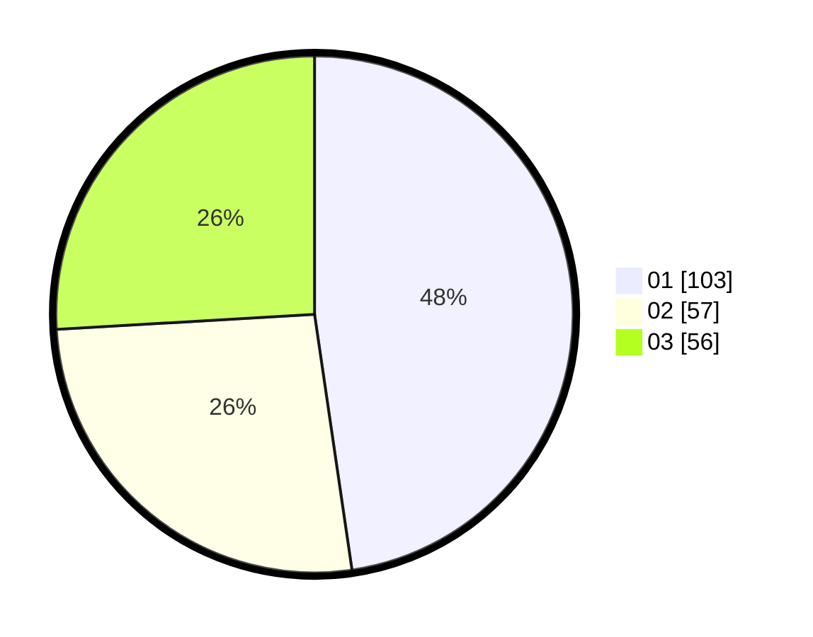

# Hasil

Hasil perolehan suara paslon dapat dilihat pada file paslon-01.txt, paslon-02.txt, dan paslon-03.txt.

Jika tidak ada, artinya data tersebut belum ada pada SIREKAP.

## Perolehan Suara

 * Paslon 01: **103**.
 * Paslon 02: **57**.
 * Paslon 03: **56**.

## Foto C Plano

https://sirekap-obj-formc.kpu.go.id/8a1e/pemilu/ppwp/31/75/07/10/05/3175071005073-20240215-002525--db88c68c-6499-4dee-810c-dcc15a756635.jpg

https://sirekap-obj-formc.kpu.go.id/8a1e/pemilu/ppwp/31/75/07/10/05/3175071005073-20240215-002620--6f34f571-af85-4e6e-8fc3-2e79295d0286.jpg

https://sirekap-obj-formc.kpu.go.id/8a1e/pemilu/ppwp/31/75/07/10/05/3175071005073-20240215-002658--a3e9cccc-adda-4543-8494-cfc680b822f2.jpg
