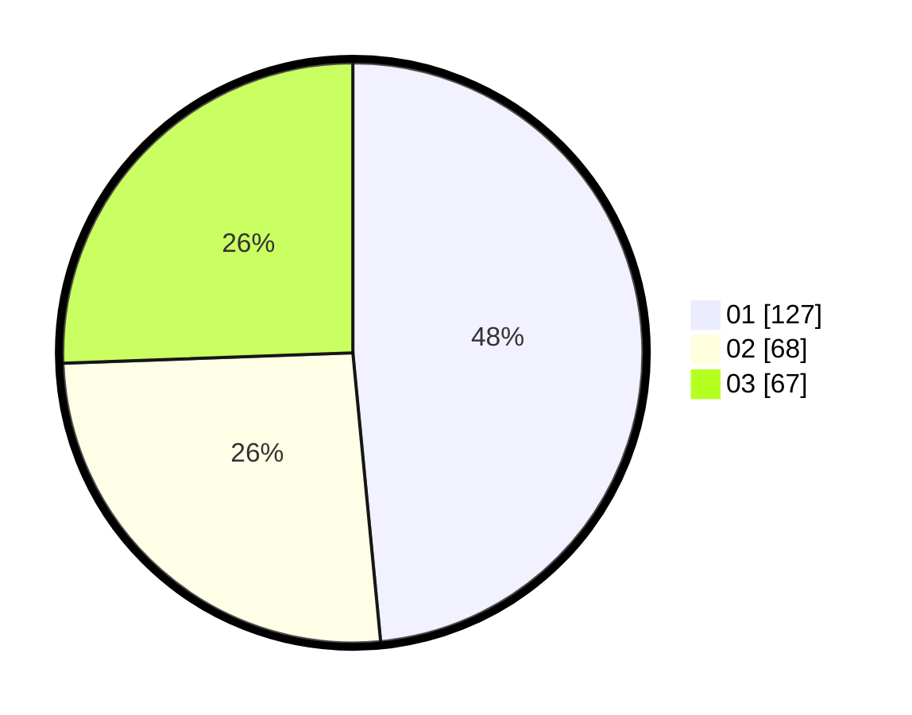

# Hasil

Hasil perolehan suara paslon dapat dilihat pada file paslon-01.txt, paslon-02.txt, dan paslon-03.txt.

Jika tidak ada, artinya data tersebut belum ada pada SIREKAP.

## Perolehan Suara

 * Paslon 01: **127**.
 * Paslon 02: **68**.
 * Paslon 03: **67**.

## Foto C Plano

https://sirekap-obj-formc.kpu.go.id/2e31/pemilu/ppwp/31/75/07/10/05/3175071005086-20240214-200525--aeb7fb8a-ba2c-4374-b379-4e20d8dae97d.jpg

https://sirekap-obj-formc.kpu.go.id/2e31/pemilu/ppwp/31/75/07/10/05/3175071005086-20240214-200542--fc21dd87-ed4a-4222-9417-f0250209219f.jpg

https://sirekap-obj-formc.kpu.go.id/2e31/pemilu/ppwp/31/75/07/10/05/3175071005086-20240214-200555--dd4e8aab-17ae-4b38-9a0d-eebd2ebe1344.jpg

## DATA PEMILIH TETAP

Jumlah pemilih dalam DPT: **298**.
 * L: **135**.
 * P: **163**.

## DATA PENGGUNA HAK PILIH

Jumlah pengguna hak pilih dalam DPT: **257**.
 * L: **117**.
 * P: **140**.

Jumlah pengguna hak pilih dalam DPTb: **2**.
 * L: **1**.
 * P: **1**.

Jumlah pengguna hak pilih dalam DPK: **1**.
 * L: **0**.
 * P: **1**.

Jumlah pengguna hak pilih: **260**.
 * L: **118**.
 * P: **142**.

## JUMLAH SUARA SAH DAN TIDAK SAH

JUMLAH SELURUH SUARA SAH: **258**.

JUMLAH SUARA TIDAK SAH: **2**.

JUMLAH SELURUH SUARA SAH DAN SUARA TIDAK SAH: **260**.
