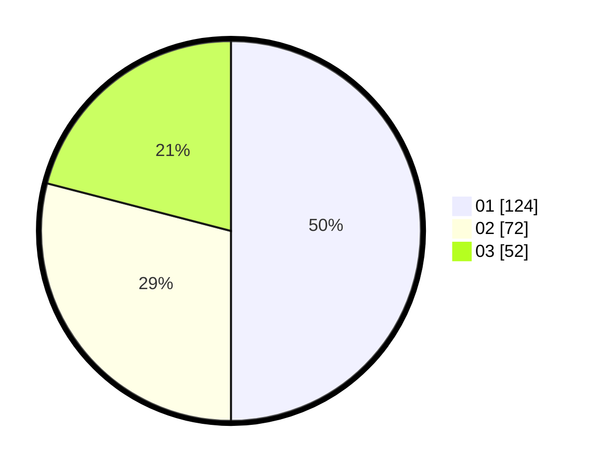

# Hasil

Hasil perolehan suara paslon dapat dilihat pada file paslon-01.txt, paslon-02.txt, dan paslon-03.txt.

Jika tidak ada, artinya data tersebut belum ada pada SIREKAP.

## Perolehan Suara

 * Paslon 01: **124**.
 * Paslon 02: **72**.
 * Paslon 03: **52**.

## Foto C Plano

https://sirekap-obj-formc.kpu.go.id/58b7/pemilu/ppwp/31/75/07/10/05/3175071005089-20240214-200054--64469d30-1f95-4f09-a2c0-7ca5e45ca644.jpg

https://sirekap-obj-formc.kpu.go.id/58b7/pemilu/ppwp/31/75/07/10/05/3175071005089-20240214-192227--38e9c8e2-5d5e-4c41-a10c-817763e21aa6.jpg

https://sirekap-obj-formc.kpu.go.id/58b7/pemilu/ppwp/31/75/07/10/05/3175071005089-20240214-192357--ae207103-dfc6-4de2-b9dd-692d35fe0daf.jpg

## DATA PEMILIH TETAP

Jumlah pemilih dalam DPT: **294**.
 * L: **144**.
 * P: **150**.

## DATA PENGGUNA HAK PILIH

Jumlah pengguna hak pilih dalam DPT: **244**.
 * L: **114**.
 * P: **130**.

Jumlah pengguna hak pilih dalam DPTb: **2**.
 * L: **2**.
 * P: **0**.

Jumlah pengguna hak pilih dalam DPK: **3**.
 * L: **1**.
 * P: **2**.

Jumlah pengguna hak pilih: **249**.
 * L: **117**.
 * P: **132**.

## JUMLAH SUARA SAH DAN TIDAK SAH

JUMLAH SELURUH SUARA SAH: **248**.

JUMLAH SUARA TIDAK SAH: **1**.

JUMLAH SELURUH SUARA SAH DAN SUARA TIDAK SAH: **249**.
