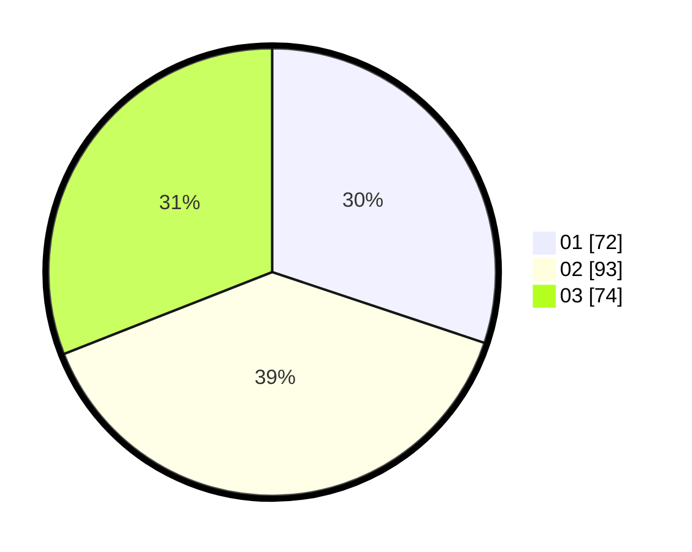

# Hasil

Hasil perolehan suara paslon dapat dilihat pada file paslon-01.txt, paslon-02.txt, dan paslon-03.txt.

Jika tidak ada, artinya data tersebut belum ada pada SIREKAP.

## Perolehan Suara

 * Paslon 01: **72**.
 * Paslon 02: **93**.
 * Paslon 03: **74**.

## Foto C Plano

https://sirekap-obj-formc.kpu.go.id/a11b/pemilu/ppwp/31/75/07/10/06/3175071006003-20240216-152158--e2c671c6-75c5-4d0a-bafa-78f56bf4dec9.jpg

https://sirekap-obj-formc.kpu.go.id/a11b/pemilu/ppwp/31/75/07/10/06/3175071006003-20240216-152159--2c995507-e36d-4e85-b577-9265296d775d.jpg

https://sirekap-obj-formc.kpu.go.id/a11b/pemilu/ppwp/31/75/07/10/06/3175071006003-20240216-152158--5bc9f41e-6551-4050-b90b-29425a57e881.jpg

## DATA PEMILIH TETAP

Jumlah pemilih dalam DPT: **281**.
 * L: **133**.
 * P: **148**.

## DATA PENGGUNA HAK PILIH

Jumlah pengguna hak pilih dalam DPT: **236**.
 * L: **108**.
 * P: **128**.

Jumlah pengguna hak pilih dalam DPTb: **5**.
 * L: **3**.
 * P: **2**.

Jumlah pengguna hak pilih dalam DPK: **0**.
 * L: **0**.
 * P: **1**.

Jumlah pengguna hak pilih: **242**.
 * L: **111**.
 * P: **131**.

## JUMLAH SUARA SAH DAN TIDAK SAH

JUMLAH SELURUH SUARA SAH: **239**.

JUMLAH SUARA TIDAK SAH: **3**.

JUMLAH SELURUH SUARA SAH DAN SUARA TIDAK SAH: **242**.
