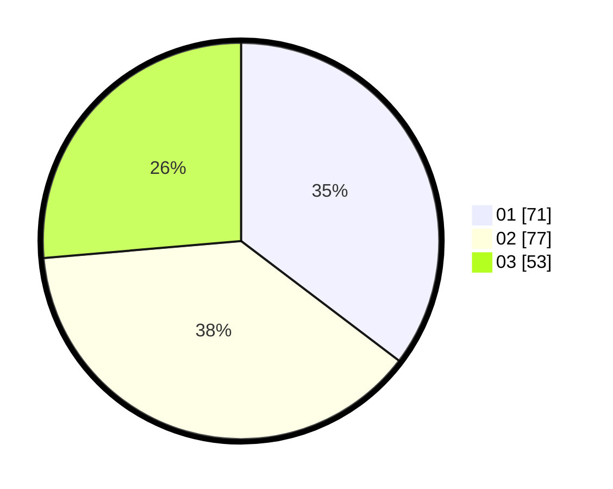

# Hasil

Hasil perolehan suara paslon dapat dilihat pada file paslon-01.txt, paslon-02.txt, dan paslon-03.txt.

Jika tidak ada, artinya data tersebut belum ada pada SIREKAP.

## Perolehan Suara

 * Paslon 01: **71**.
 * Paslon 02: **77**.
 * Paslon 03: **53**.

## Foto C Plano

https://sirekap-obj-formc.kpu.go.id/8bba/pemilu/ppwp/31/75/07/10/06/3175071006007-20240216-141611--827ee56e-510d-40a7-a43e-21fd2eb7c6b4.jpg

https://sirekap-obj-formc.kpu.go.id/8bba/pemilu/ppwp/31/75/07/10/06/3175071006007-20240216-141612--ee908e08-29ba-4ce5-bce7-dab8aa17f3dc.jpg

https://sirekap-obj-formc.kpu.go.id/8bba/pemilu/ppwp/31/75/07/10/06/3175071006007-20240216-141612--1fc931d0-c67a-43f6-a691-f627598328bf.jpg

## DATA PEMILIH TETAP

Jumlah pemilih dalam DPT: **279**.
 * L: **140**.
 * P: **139**.

## DATA PENGGUNA HAK PILIH

Jumlah pengguna hak pilih dalam DPT: **203**.
 * L: **98**.
 * P: **105**.

Jumlah pengguna hak pilih dalam DPTb: **2**.
 * L: **0**.
 * P: **2**.

Jumlah pengguna hak pilih dalam DPK: **0**.
 * L: **0**.
 * P: **0**.

Jumlah pengguna hak pilih: **205**.
 * L: **98**.
 * P: **107**.

## JUMLAH SUARA SAH DAN TIDAK SAH

JUMLAH SELURUH SUARA SAH: **201**.

JUMLAH SUARA TIDAK SAH: **5**.

JUMLAH SELURUH SUARA SAH DAN SUARA TIDAK SAH: **206**.
