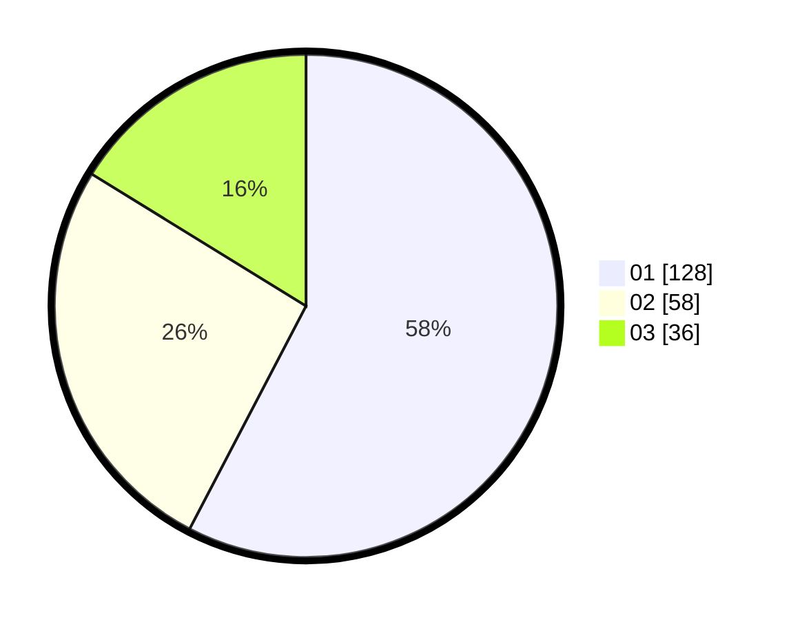

# Hasil

Hasil perolehan suara paslon dapat dilihat pada file paslon-01.txt, paslon-02.txt, dan paslon-03.txt.

Jika tidak ada, artinya data tersebut belum ada pada SIREKAP.

## Perolehan Suara

 * Paslon 01: **128**.
 * Paslon 02: **58**.
 * Paslon 03: **36**.

## Foto C Plano

https://sirekap-obj-formc.kpu.go.id/ceef/pemilu/ppwp/31/75/07/10/06/3175071006011-20240216-115515--d3915ab3-4804-4338-9e66-23502e9b3838.jpg

https://sirekap-obj-formc.kpu.go.id/ceef/pemilu/ppwp/31/75/07/10/06/3175071006011-20240216-115525--ca22dbdb-0e8e-4596-a3d0-bdd3cf4a8738.jpg

https://sirekap-obj-formc.kpu.go.id/ceef/pemilu/ppwp/31/75/07/10/06/3175071006011-20240216-115519--90069452-1f50-411d-80bb-2ddb1e32288e.jpg

## DATA PEMILIH TETAP

Jumlah pemilih dalam DPT: **224**.
 * L: **103**.
 * P: **121**.

## DATA PENGGUNA HAK PILIH

Jumlah pengguna hak pilih dalam DPT: **221**.
 * L: **101**.
 * P: **120**.

Jumlah pengguna hak pilih dalam DPTb: **0**.
 * L: **0**.
 * P: **0**.

Jumlah pengguna hak pilih dalam DPK: **3**.
 * L: **2**.
 * P: **4**.

Jumlah pengguna hak pilih: **224**.
 * L: **103**.
 * P: **121**.

## JUMLAH SUARA SAH DAN TIDAK SAH

JUMLAH SELURUH SUARA SAH: **222**.

JUMLAH SUARA TIDAK SAH: **2**.

JUMLAH SELURUH SUARA SAH DAN SUARA TIDAK SAH: **224**.
