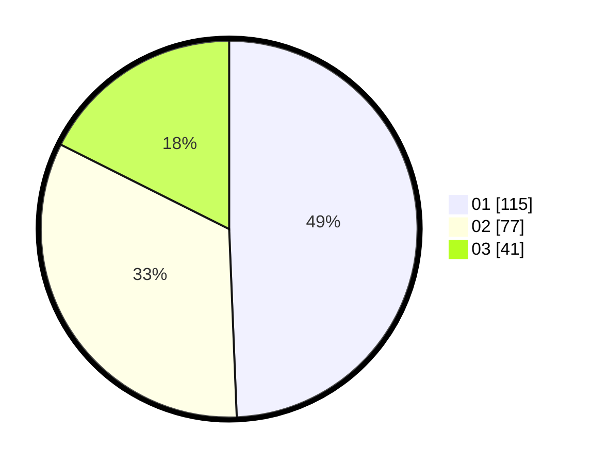

# Hasil

Hasil perolehan suara paslon dapat dilihat pada file paslon-01.txt, paslon-02.txt, dan paslon-03.txt.

Jika tidak ada, artinya data tersebut belum ada pada SIREKAP.

## Perolehan Suara

 * Paslon 01: **115**.
 * Paslon 02: **77**.
 * Paslon 03: **41**.

## Foto C Plano

https://sirekap-obj-formc.kpu.go.id/cd3a/pemilu/ppwp/31/75/07/10/06/3175071006012-20240214-230042--fdac1c28-8f56-420d-9de3-4b8c5df50604.jpg

https://sirekap-obj-formc.kpu.go.id/cd3a/pemilu/ppwp/31/75/07/10/06/3175071006012-20240214-224936--8c3cf765-a935-4a68-8189-b4160081ad3a.jpg

https://sirekap-obj-formc.kpu.go.id/cd3a/pemilu/ppwp/31/75/07/10/06/3175071006012-20240214-232420--70a5570d-a108-495f-80fc-75103ad6fb55.jpg
