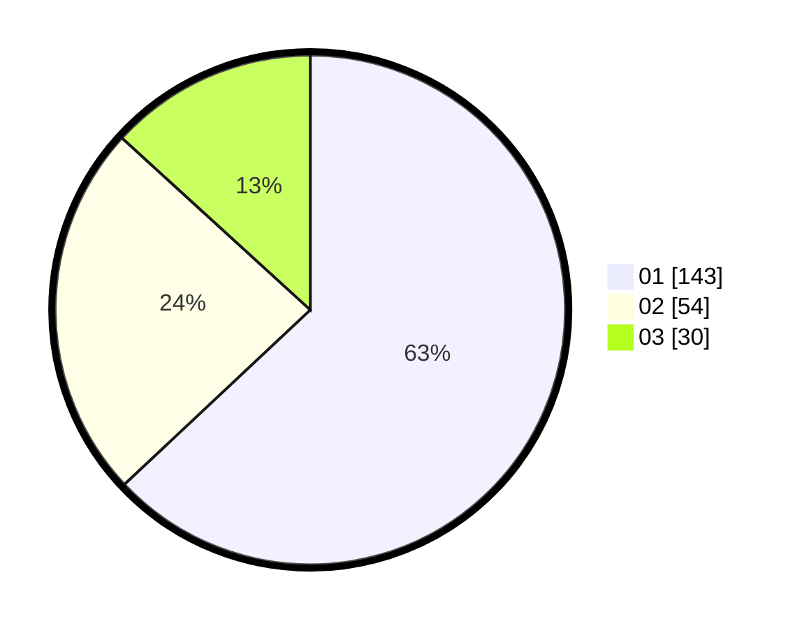

# Hasil

Hasil perolehan suara paslon dapat dilihat pada file paslon-01.txt, paslon-02.txt, dan paslon-03.txt.

Jika tidak ada, artinya data tersebut belum ada pada SIREKAP.

## Perolehan Suara

 * Paslon 01: **143**.
 * Paslon 02: **54**.
 * Paslon 03: **30**.

## Foto C Plano

https://sirekap-obj-formc.kpu.go.id/adb2/pemilu/ppwp/31/75/07/10/06/3175071006016-20240216-144800--508acd8b-0c40-492e-b8d4-6744425cdb39.jpg

https://sirekap-obj-formc.kpu.go.id/adb2/pemilu/ppwp/31/75/07/10/06/3175071006016-20240216-144801--dca34169-8f34-47f7-93e7-91c9c3bf1248.jpg

https://sirekap-obj-formc.kpu.go.id/adb2/pemilu/ppwp/31/75/07/10/06/3175071006016-20240215-002520--13e7dcfe-a697-43a7-8e2e-08e94175665b.jpg

## DATA PEMILIH TETAP

Jumlah pemilih dalam DPT: **268**.
 * L: **121**.
 * P: **147**.

## DATA PENGGUNA HAK PILIH

Jumlah pengguna hak pilih dalam DPT: **214**.
 * L: **91**.
 * P: **123**.

Jumlah pengguna hak pilih dalam DPTb: **12**.
 * L: **9**.
 * P: **3**.

Jumlah pengguna hak pilih dalam DPK: **2**.
 * L: **1**.
 * P: **1**.

Jumlah pengguna hak pilih: **228**.
 * L: **101**.
 * P: **127**.

## JUMLAH SUARA SAH DAN TIDAK SAH

JUMLAH SELURUH SUARA SAH: **227**.

JUMLAH SUARA TIDAK SAH: **1**.

JUMLAH SELURUH SUARA SAH DAN SUARA TIDAK SAH: **228**.
