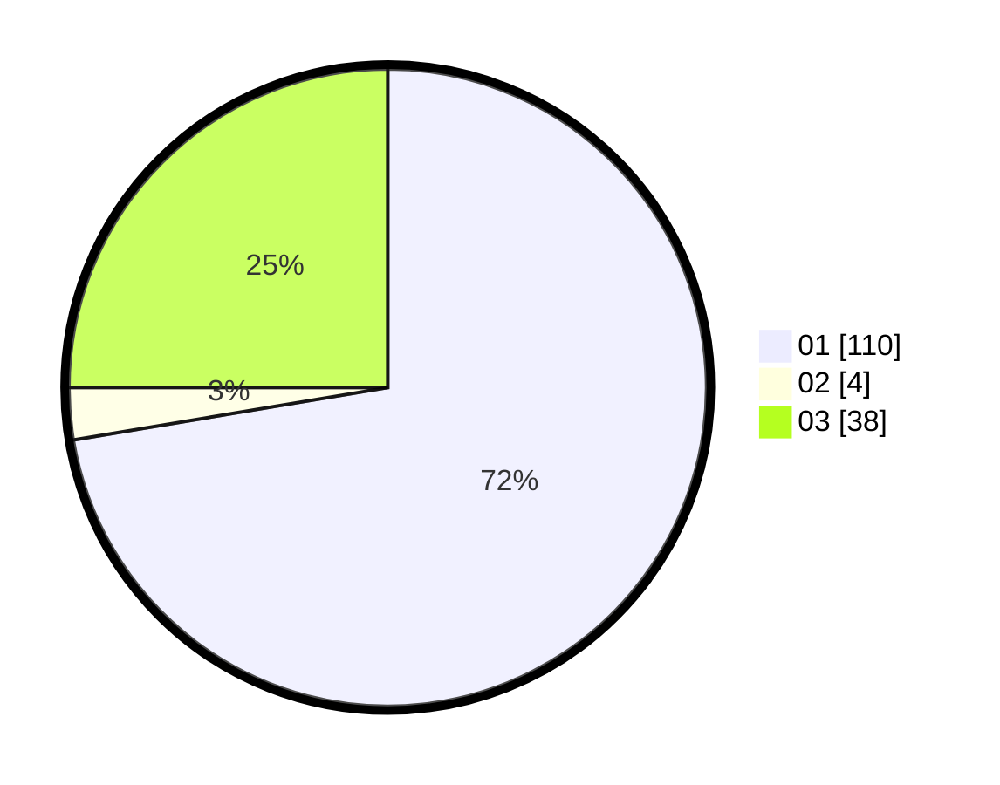

# Hasil

Hasil perolehan suara paslon dapat dilihat pada file paslon-01.txt, paslon-02.txt, dan paslon-03.txt.

Jika tidak ada, artinya data tersebut belum ada pada SIREKAP.

## Perolehan Suara

 * Paslon 01: **110**.
 * Paslon 02: **4**.
 * Paslon 03: **38**.

## Foto C Plano

https://sirekap-obj-formc.kpu.go.id/1aba/pemilu/ppwp/31/75/07/10/06/3175071006019-20240215-002734--4ec5afca-848b-40bf-a4ac-e4327b71b140.jpg

https://sirekap-obj-formc.kpu.go.id/1aba/pemilu/ppwp/31/75/07/10/06/3175071006019-20240215-002806--e94882cb-1d95-44bb-b554-c7955ea3fd10.jpg

https://sirekap-obj-formc.kpu.go.id/1aba/pemilu/ppwp/31/75/07/10/06/3175071006019-20240215-002829--36f77ce3-1c52-4cf4-93d8-5626b9b3144f.jpg

## DATA PEMILIH TETAP

Jumlah pemilih dalam DPT: **260**.
 * L: **127**.
 * P: **133**.

## DATA PENGGUNA HAK PILIH

Jumlah pengguna hak pilih dalam DPT: **220**.
 * L: **103**.
 * P: **117**.

Jumlah pengguna hak pilih dalam DPTb: **2**.
 * L: **0**.
 * P: **2**.

Jumlah pengguna hak pilih dalam DPK: **1**.
 * L: **1**.
 * P: **0**.

Jumlah pengguna hak pilih: **223**.
 * L: **104**.
 * P: **119**.

## JUMLAH SUARA SAH DAN TIDAK SAH

JUMLAH SELURUH SUARA SAH: **220**.

JUMLAH SUARA TIDAK SAH: **3**.

JUMLAH SELURUH SUARA SAH DAN SUARA TIDAK SAH: **223**.
