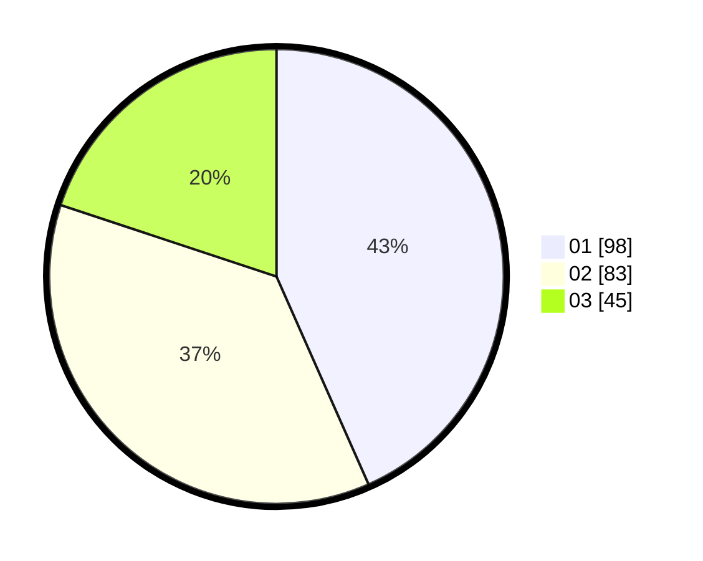

# Hasil

Hasil perolehan suara paslon dapat dilihat pada file paslon-01.txt, paslon-02.txt, dan paslon-03.txt.

Jika tidak ada, artinya data tersebut belum ada pada SIREKAP.

## Perolehan Suara

 * Paslon 01: **98**.
 * Paslon 02: **83**.
 * Paslon 03: **45**.

## Foto C Plano

https://sirekap-obj-formc.kpu.go.id/ba54/pemilu/ppwp/31/75/07/10/06/3175071006023-20240215-215611--87e33bb1-80d0-4c53-840b-e36473203e05.jpg

https://sirekap-obj-formc.kpu.go.id/ba54/pemilu/ppwp/31/75/07/10/06/3175071006023-20240215-215614--2d7fa21c-f71f-4a75-95ad-bcf24be8db9d.jpg

https://sirekap-obj-formc.kpu.go.id/ba54/pemilu/ppwp/31/75/07/10/06/3175071006023-20240215-215613--2b3f969c-3c61-4506-afef-1b59559c3538.jpg

## DATA PEMILIH TETAP

Jumlah pemilih dalam DPT: **264**.
 * L: **125**.
 * P: **139**.

## DATA PENGGUNA HAK PILIH

Jumlah pengguna hak pilih dalam DPT: **226**.
 * L: **100**.
 * P: **126**.

Jumlah pengguna hak pilih dalam DPTb: **2**.
 * L: **1**.
 * P: **1**.

Jumlah pengguna hak pilih dalam DPK: **2**.
 * L: **0**.
 * P: **2**.

Jumlah pengguna hak pilih: **230**.
 * L: **101**.
 * P: **129**.

## JUMLAH SUARA SAH DAN TIDAK SAH

JUMLAH SELURUH SUARA SAH: **226**.

JUMLAH SUARA TIDAK SAH: **4**.

JUMLAH SELURUH SUARA SAH DAN SUARA TIDAK SAH: **230**.
