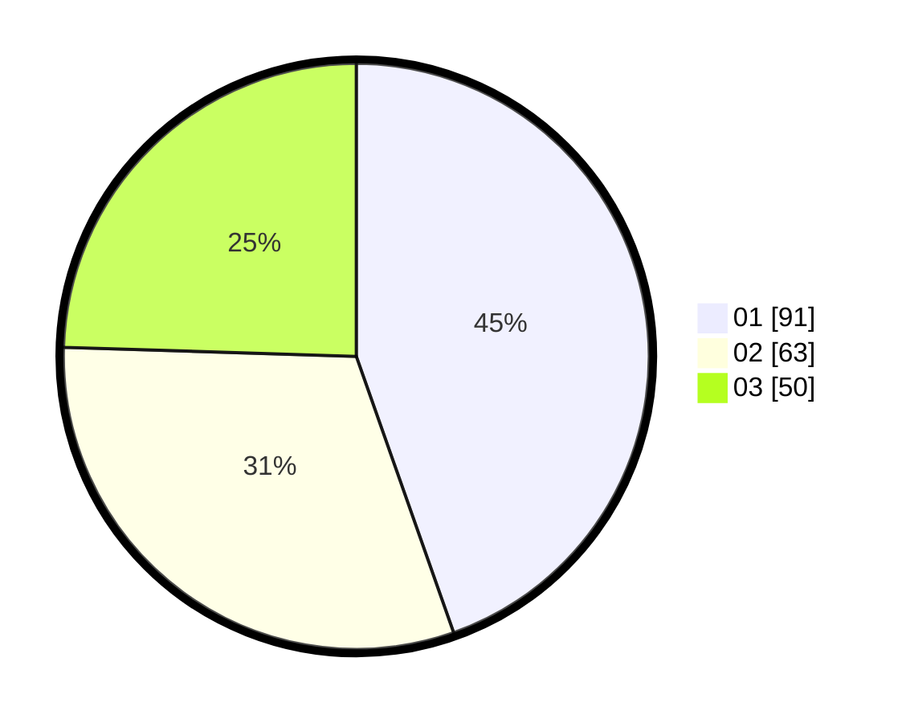

# Hasil

Hasil perolehan suara paslon dapat dilihat pada file paslon-01.txt, paslon-02.txt, dan paslon-03.txt.

Jika tidak ada, artinya data tersebut belum ada pada SIREKAP.

## Perolehan Suara

 * Paslon 01: **91**.
 * Paslon 02: **63**.
 * Paslon 03: **50**.

## Foto C Plano

https://sirekap-obj-formc.kpu.go.id/988b/pemilu/ppwp/31/75/07/10/06/3175071006033-20240214-212827--5e9c0861-9962-4ab9-9855-92742f06419e.jpg

https://sirekap-obj-formc.kpu.go.id/988b/pemilu/ppwp/31/75/07/10/06/3175071006033-20240214-212855--7f2d8985-3205-4ae1-b748-0266eb2ea656.jpg

https://sirekap-obj-formc.kpu.go.id/988b/pemilu/ppwp/31/75/07/10/06/3175071006033-20240214-224539--41104057-9ae3-4f6b-b4e5-99c810a776cf.jpg

## DATA PEMILIH TETAP

Jumlah pemilih dalam DPT: **257**.
 * L: **130**.
 * P: **127**.

## DATA PENGGUNA HAK PILIH

Jumlah pengguna hak pilih dalam DPT: **206**.
 * L: **102**.
 * P: **104**.

Jumlah pengguna hak pilih dalam DPTb: **1**.
 * L: **0**.
 * P: **1**.

Jumlah pengguna hak pilih dalam DPK: **0**.
 * L: **0**.
 * P: **0**.

Jumlah pengguna hak pilih: **207**.
 * L: **102**.
 * P: **105**.

## JUMLAH SUARA SAH DAN TIDAK SAH

JUMLAH SELURUH SUARA SAH: **204**.

JUMLAH SUARA TIDAK SAH: **3**.

JUMLAH SELURUH SUARA SAH DAN SUARA TIDAK SAH: **207**.
