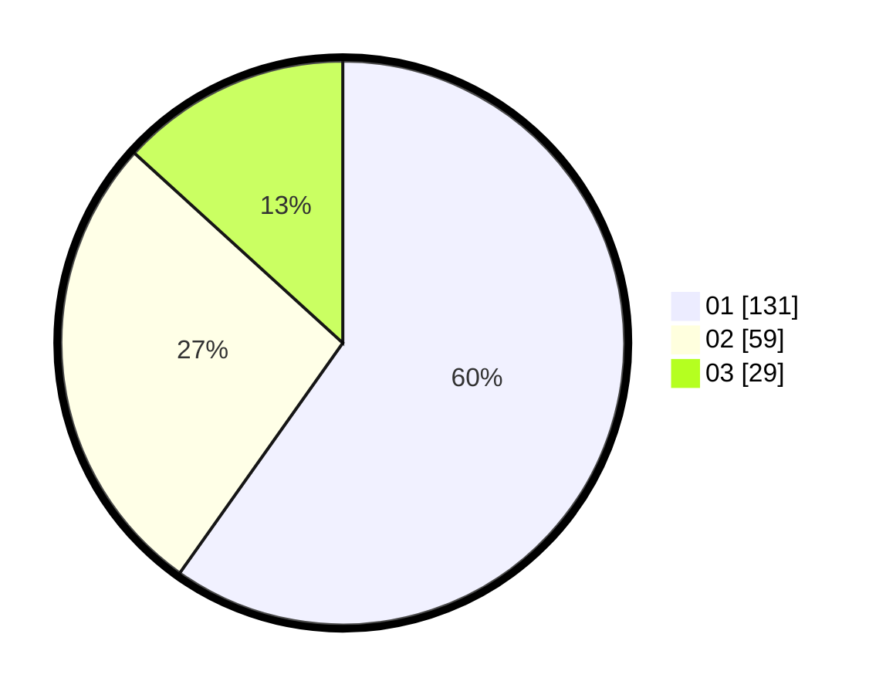

# Hasil

Hasil perolehan suara paslon dapat dilihat pada file paslon-01.txt, paslon-02.txt, dan paslon-03.txt.

Jika tidak ada, artinya data tersebut belum ada pada SIREKAP.

## Perolehan Suara

 * Paslon 01: **131**.
 * Paslon 02: **59**.
 * Paslon 03: **29**.

## Foto C Plano

https://sirekap-obj-formc.kpu.go.id/b315/pemilu/ppwp/31/75/07/10/06/3175071006036-20240216-110130--9fb97826-3009-483d-9d22-9a8c8b93e96b.jpg

https://sirekap-obj-formc.kpu.go.id/b315/pemilu/ppwp/31/75/07/10/06/3175071006036-20240216-110225--65ec5c43-39a9-4342-b61d-345e99987718.jpg

https://sirekap-obj-formc.kpu.go.id/b315/pemilu/ppwp/31/75/07/10/06/3175071006036-20240216-110223--44255c4c-5ac8-4e87-be4a-5d36884b1c36.jpg

## DATA PEMILIH TETAP

Jumlah pemilih dalam DPT: **254**.
 * L: **118**.
 * P: **136**.

## DATA PENGGUNA HAK PILIH

Jumlah pengguna hak pilih dalam DPT: **222**.
 * L: **104**.
 * P: **118**.

Jumlah pengguna hak pilih dalam DPTb: **2**.
 * L: **1**.
 * P: **1**.

Jumlah pengguna hak pilih dalam DPK: **0**.
 * L: **0**.
 * P: **0**.

Jumlah pengguna hak pilih: **224**.
 * L: **105**.
 * P: **119**.

## JUMLAH SUARA SAH DAN TIDAK SAH

JUMLAH SELURUH SUARA SAH: **219**.

JUMLAH SUARA TIDAK SAH: **5**.

JUMLAH SELURUH SUARA SAH DAN SUARA TIDAK SAH: **224**.
