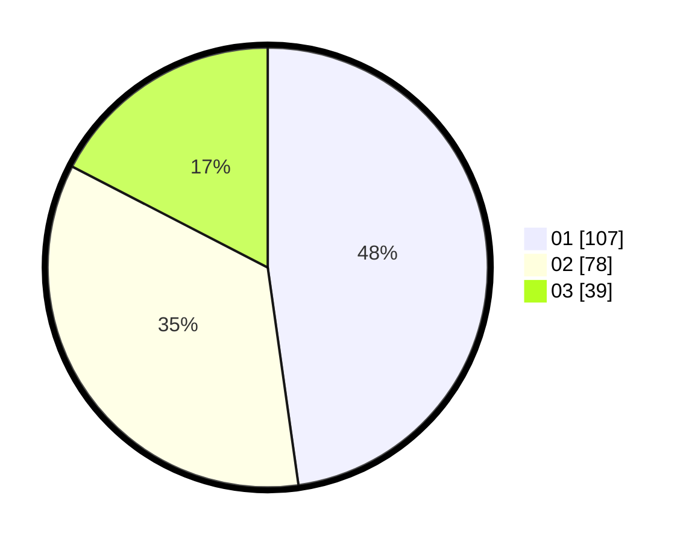

# Hasil

Hasil perolehan suara paslon dapat dilihat pada file paslon-01.txt, paslon-02.txt, dan paslon-03.txt.

Jika tidak ada, artinya data tersebut belum ada pada SIREKAP.

## Perolehan Suara

 * Paslon 01: **107**.
 * Paslon 02: **78**.
 * Paslon 03: **39**.

## Foto C Plano

https://sirekap-obj-formc.kpu.go.id/1a36/pemilu/ppwp/31/75/07/10/06/3175071006040-20240215-013107--8d71801c-2324-4c6b-ac04-929185566340.jpg

https://sirekap-obj-formc.kpu.go.id/1a36/pemilu/ppwp/31/75/07/10/06/3175071006040-20240215-013404--1d8227dc-e90e-44d5-9424-e7910311cbc5.jpg

https://sirekap-obj-formc.kpu.go.id/1a36/pemilu/ppwp/31/75/07/10/06/3175071006040-20240215-020144--b4a9e19f-51c4-4265-b0cd-91ad43900abb.jpg
