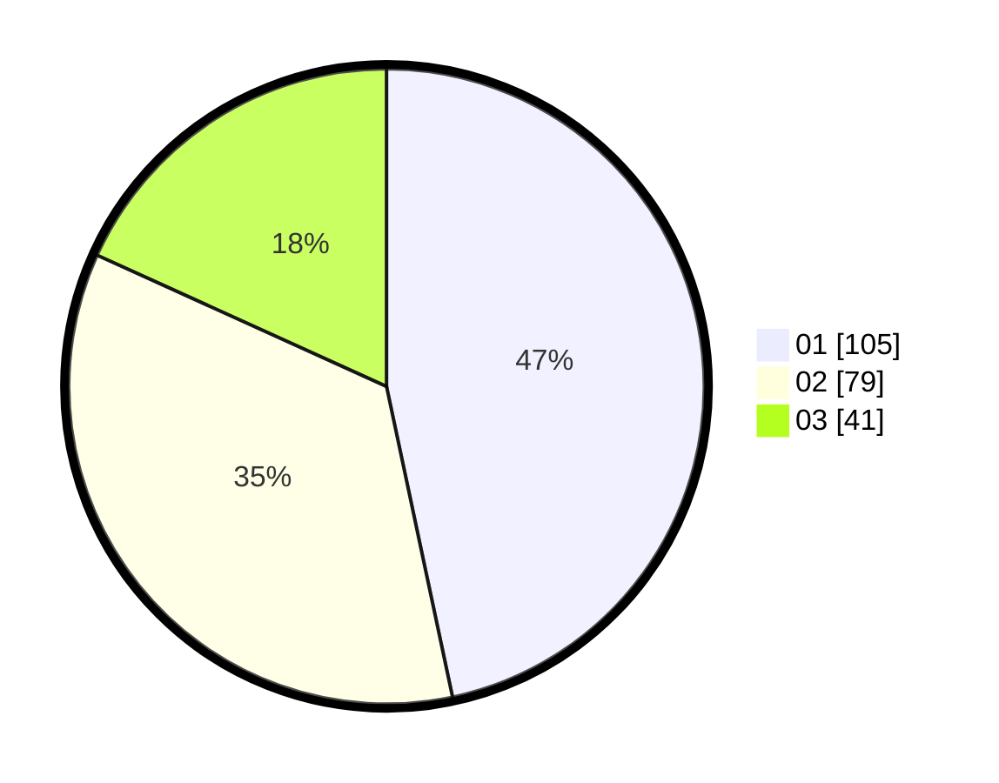

# Hasil

Hasil perolehan suara paslon dapat dilihat pada file paslon-01.txt, paslon-02.txt, dan paslon-03.txt.

Jika tidak ada, artinya data tersebut belum ada pada SIREKAP.

## Perolehan Suara

 * Paslon 01: **105**.
 * Paslon 02: **79**.
 * Paslon 03: **41**.

## Foto C Plano

https://sirekap-obj-formc.kpu.go.id/641c/pemilu/ppwp/31/75/07/10/06/3175071006041-20240214-175315--ee476beb-e671-44d2-a6d3-6edb45139b26.jpg

https://sirekap-obj-formc.kpu.go.id/641c/pemilu/ppwp/31/75/07/10/06/3175071006041-20240214-185958--7d04c1d5-b32d-4df1-a706-45776378d921.jpg

https://sirekap-obj-formc.kpu.go.id/641c/pemilu/ppwp/31/75/07/10/06/3175071006041-20240214-190205--7ca360c1-749f-46fd-9367-97c273039121.jpg

## DATA PEMILIH TETAP

Jumlah pemilih dalam DPT: **272**.
 * L: **126**.
 * P: **146**.

## DATA PENGGUNA HAK PILIH

Jumlah pengguna hak pilih dalam DPT: **225**.
 * L: **103**.
 * P: **122**.

Jumlah pengguna hak pilih dalam DPTb: **1**.
 * L: **1**.
 * P: **0**.

Jumlah pengguna hak pilih dalam DPK: **0**.
 * L: **0**.
 * P: **0**.

Jumlah pengguna hak pilih: **226**.
 * L: **104**.
 * P: **122**.

## JUMLAH SUARA SAH DAN TIDAK SAH

JUMLAH SELURUH SUARA SAH: **225**.

JUMLAH SUARA TIDAK SAH: **1**.

JUMLAH SELURUH SUARA SAH DAN SUARA TIDAK SAH: **226**.
