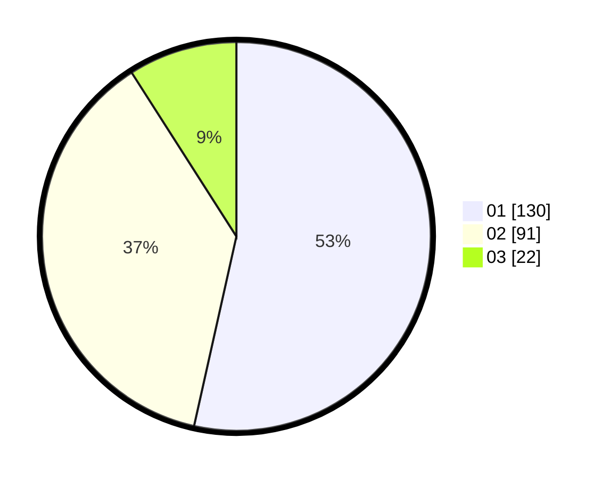

# Hasil

Hasil perolehan suara paslon dapat dilihat pada file paslon-01.txt, paslon-02.txt, dan paslon-03.txt.

Jika tidak ada, artinya data tersebut belum ada pada SIREKAP.

## Perolehan Suara

 * Paslon 01: **130**.
 * Paslon 02: **91**.
 * Paslon 03: **22**.

## Foto C Plano

https://sirekap-obj-formc.kpu.go.id/2666/pemilu/ppwp/31/75/07/10/06/3175071006048-20240216-143132--9d4c0267-6be5-40dd-801d-db743ca14e34.jpg

https://sirekap-obj-formc.kpu.go.id/2666/pemilu/ppwp/31/75/07/10/06/3175071006048-20240216-143133--035fc300-7dfd-45b9-81f0-d190ae1fd68b.jpg

https://sirekap-obj-formc.kpu.go.id/2666/pemilu/ppwp/31/75/07/10/06/3175071006048-20240214-190205--b89492c3-00c9-4ef8-91f1-a5f6c16675c3.jpg

## DATA PEMILIH TETAP

Jumlah pemilih dalam DPT: **281**.
 * L: **137**.
 * P: **144**.

## DATA PENGGUNA HAK PILIH

Jumlah pengguna hak pilih dalam DPT: **243**.
 * L: **115**.
 * P: **128**.

Jumlah pengguna hak pilih dalam DPTb: **2**.
 * L: **1**.
 * P: **1**.

Jumlah pengguna hak pilih dalam DPK: **0**.
 * L: **0**.
 * P: **0**.

Jumlah pengguna hak pilih: **245**.
 * L: **116**.
 * P: **129**.

## JUMLAH SUARA SAH DAN TIDAK SAH

JUMLAH SELURUH SUARA SAH: **243**.

JUMLAH SUARA TIDAK SAH: **2**.

JUMLAH SELURUH SUARA SAH DAN SUARA TIDAK SAH: **245**.
