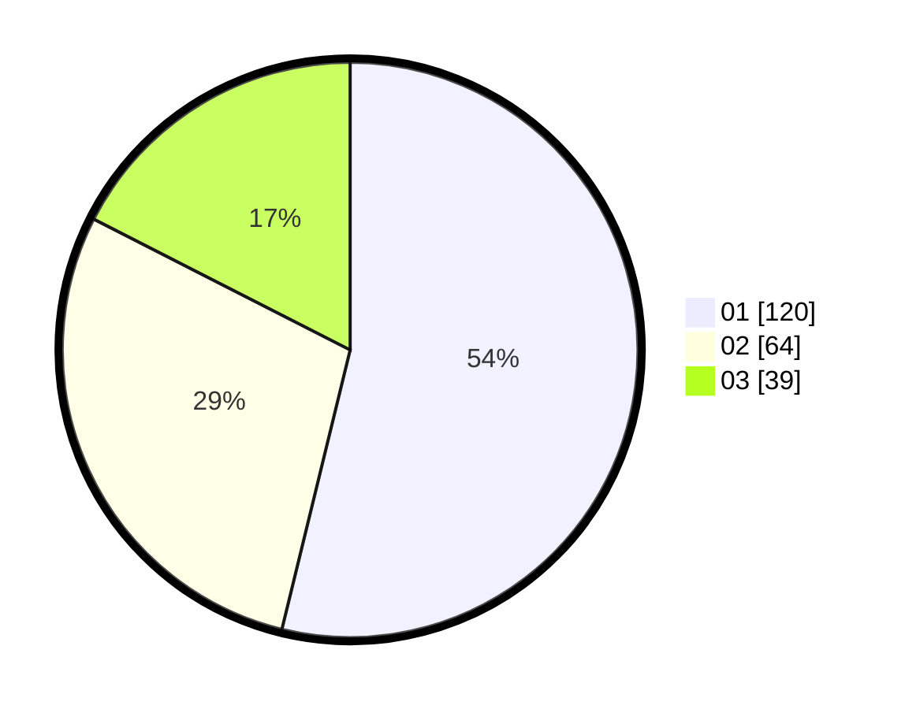

# Hasil

Hasil perolehan suara paslon dapat dilihat pada file paslon-01.txt, paslon-02.txt, dan paslon-03.txt.

Jika tidak ada, artinya data tersebut belum ada pada SIREKAP.

## Perolehan Suara

 * Paslon 01: **120**.
 * Paslon 02: **64**.
 * Paslon 03: **39**.

## Foto C Plano

https://sirekap-obj-formc.kpu.go.id/8ddf/pemilu/ppwp/31/75/07/10/06/3175071006052-20240215-231531--6a128c68-2f02-4c12-a868-ab21579bb39d.jpg

https://sirekap-obj-formc.kpu.go.id/8ddf/pemilu/ppwp/31/75/07/10/06/3175071006052-20240215-231534--42ba5769-8799-483b-a772-5e3f67fbf193.jpg

https://sirekap-obj-formc.kpu.go.id/8ddf/pemilu/ppwp/31/75/07/10/06/3175071006052-20240215-231532--c706fbca-c289-4f07-adf0-34e55fed0ffc.jpg

## DATA PEMILIH TETAP

Jumlah pemilih dalam DPT: **265**.
 * L: **131**.
 * P: **134**.

## DATA PENGGUNA HAK PILIH

Jumlah pengguna hak pilih dalam DPT: **224**.
 * L: **110**.
 * P: **114**.

Jumlah pengguna hak pilih dalam DPTb: **1**.
 * L: **0**.
 * P: **1**.

Jumlah pengguna hak pilih dalam DPK: **0**.
 * L: **0**.
 * P: **0**.

Jumlah pengguna hak pilih: **225**.
 * L: **110**.
 * P: **115**.

## JUMLAH SUARA SAH DAN TIDAK SAH

JUMLAH SELURUH SUARA SAH: **223**.

JUMLAH SUARA TIDAK SAH: **2**.

JUMLAH SELURUH SUARA SAH DAN SUARA TIDAK SAH: **225**.
