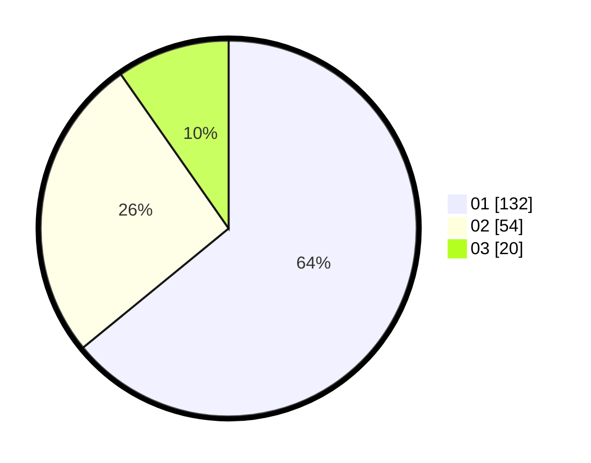

# Hasil

Hasil perolehan suara paslon dapat dilihat pada file paslon-01.txt, paslon-02.txt, dan paslon-03.txt.

Jika tidak ada, artinya data tersebut belum ada pada SIREKAP.

## Perolehan Suara

 * Paslon 01: **132**.
 * Paslon 02: **54**.
 * Paslon 03: **20**.

## Foto C Plano

https://sirekap-obj-formc.kpu.go.id/cd2d/pemilu/ppwp/31/75/07/10/06/3175071006056-20240217-075002--032c37d5-16cb-4261-a96a-98a143757a47.jpg

https://sirekap-obj-formc.kpu.go.id/cd2d/pemilu/ppwp/31/75/07/10/06/3175071006056-20240217-075003--ff065b68-0379-4dd9-ac53-5b7b6b47834f.jpg

https://sirekap-obj-formc.kpu.go.id/cd2d/pemilu/ppwp/31/75/07/10/06/3175071006056-20240217-075002--c3919ae0-4bb9-4127-87d9-1394e4c5522f.jpg

## DATA PEMILIH TETAP

Jumlah pemilih dalam DPT: **207**.
 * L: **88**.
 * P: **119**.

## DATA PENGGUNA HAK PILIH

Jumlah pengguna hak pilih dalam DPT: **202**.
 * L: **85**.
 * P: **117**.

Jumlah pengguna hak pilih dalam DPTb: **3**.
 * L: **1**.
 * P: **2**.

Jumlah pengguna hak pilih dalam DPK: **2**.
 * L: **2**.
 * P: **0**.

Jumlah pengguna hak pilih: **207**.
 * L: **88**.
 * P: **119**.

## JUMLAH SUARA SAH DAN TIDAK SAH

JUMLAH SELURUH SUARA SAH: **206**.

JUMLAH SUARA TIDAK SAH: **1**.

JUMLAH SELURUH SUARA SAH DAN SUARA TIDAK SAH: **207**.
