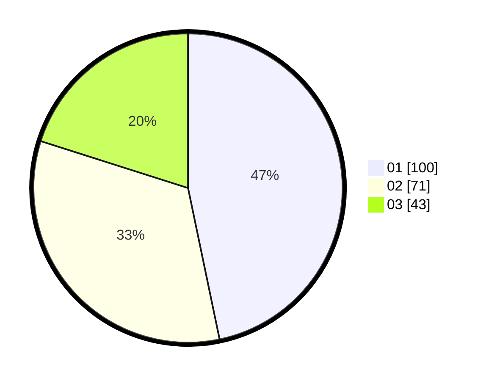

# Hasil

Hasil perolehan suara paslon dapat dilihat pada file paslon-01.txt, paslon-02.txt, dan paslon-03.txt.

Jika tidak ada, artinya data tersebut belum ada pada SIREKAP.

## Perolehan Suara

 * Paslon 01: **100**.
 * Paslon 02: **71**.
 * Paslon 03: **43**.

## Foto C Plano

https://sirekap-obj-formc.kpu.go.id/3444/pemilu/ppwp/31/75/07/10/06/3175071006058-20240214-155520--0371c967-cc65-46b6-a28e-d6e6e297d883.jpg

https://sirekap-obj-formc.kpu.go.id/3444/pemilu/ppwp/31/75/07/10/06/3175071006058-20240214-155617--c5bba935-094b-4daa-bfad-8aaada5eddbb.jpg

https://sirekap-obj-formc.kpu.go.id/3444/pemilu/ppwp/31/75/07/10/06/3175071006058-20240214-155652--947668f8-f1de-4c96-9618-bac4fc49c4dc.jpg

## DATA PEMILIH TETAP

Jumlah pemilih dalam DPT: **271**.
 * L: **126**.
 * P: **145**.

## DATA PENGGUNA HAK PILIH

Jumlah pengguna hak pilih dalam DPT: **216**.
 * L: **100**.
 * P: **116**.

Jumlah pengguna hak pilih dalam DPTb: **0**.
 * L: **0**.
 * P: **0**.

Jumlah pengguna hak pilih dalam DPK: **0**.
 * L: **0**.
 * P: **0**.

Jumlah pengguna hak pilih: **216**.
 * L: **100**.
 * P: **116**.

## JUMLAH SUARA SAH DAN TIDAK SAH

JUMLAH SELURUH SUARA SAH: **214**.

JUMLAH SUARA TIDAK SAH: **2**.

JUMLAH SELURUH SUARA SAH DAN SUARA TIDAK SAH: **216**.
