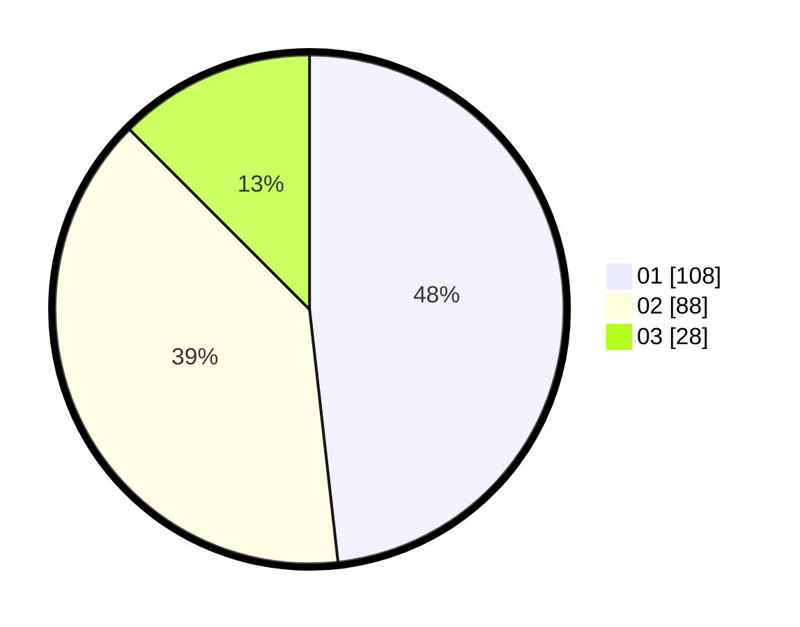

# Hasil

Hasil perolehan suara paslon dapat dilihat pada file paslon-01.txt, paslon-02.txt, dan paslon-03.txt.

Jika tidak ada, artinya data tersebut belum ada pada SIREKAP.

## Perolehan Suara

 * Paslon 01: **108**.
 * Paslon 02: **88**.
 * Paslon 03: **28**.

## Foto C Plano

https://sirekap-obj-formc.kpu.go.id/ff98/pemilu/ppwp/31/75/07/10/06/3175071006065-20240214-222534--237ef564-3a59-46d0-903d-bd440e75383f.jpg

https://sirekap-obj-formc.kpu.go.id/ff98/pemilu/ppwp/31/75/07/10/06/3175071006065-20240214-224528--11778c21-c74d-45e8-9c4f-a9c5be2cc4e2.jpg

https://sirekap-obj-formc.kpu.go.id/ff98/pemilu/ppwp/31/75/07/10/06/3175071006065-20240214-224823--e1c051a5-6156-4089-9496-e3ba02f6ed43.jpg
