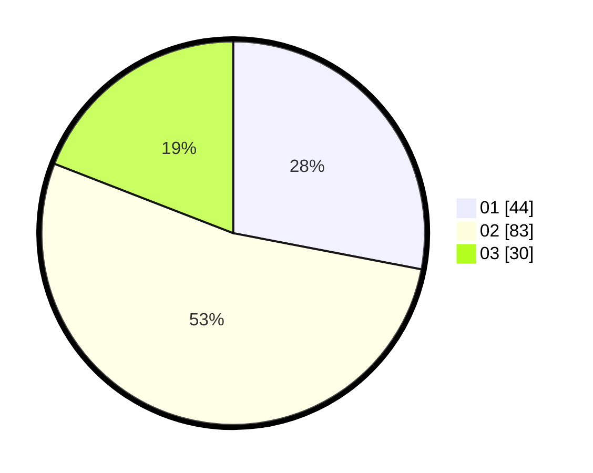

# Hasil

Hasil perolehan suara paslon dapat dilihat pada file paslon-01.txt, paslon-02.txt, dan paslon-03.txt.

Jika tidak ada, artinya data tersebut belum ada pada SIREKAP.

## Perolehan Suara

 * Paslon 01: **44**.
 * Paslon 02: **83**.
 * Paslon 03: **30**.

## Foto C Plano

https://sirekap-obj-formc.kpu.go.id/9414/pemilu/ppwp/31/75/07/10/06/3175071006069-20240214-195235--0343bc83-e31c-4e4f-b10a-22187ee6d37e.jpg

https://sirekap-obj-formc.kpu.go.id/9414/pemilu/ppwp/31/75/07/10/06/3175071006069-20240214-194015--70b2d2df-2f28-4d7a-b6a7-77bef95ddbfb.jpg

https://sirekap-obj-formc.kpu.go.id/9414/pemilu/ppwp/31/75/07/10/06/3175071006069-20240214-194120--8bf6ae3e-345f-4de7-9524-af2f40048bd6.jpg

## DATA PEMILIH TETAP

Jumlah pemilih dalam DPT: **263**.
 * L: **124**.
 * P: **139**.

## DATA PENGGUNA HAK PILIH

Jumlah pengguna hak pilih dalam DPT: **204**.
 * L: **90**.
 * P: **114**.

Jumlah pengguna hak pilih dalam DPTb: **4**.
 * L: **1**.
 * P: **3**.

Jumlah pengguna hak pilih dalam DPK: **0**.
 * L: **0**.
 * P: **0**.

Jumlah pengguna hak pilih: **208**.
 * L: **91**.
 * P: **117**.

## JUMLAH SUARA SAH DAN TIDAK SAH

JUMLAH SELURUH SUARA SAH: **207**.

JUMLAH SUARA TIDAK SAH: **1**.

JUMLAH SELURUH SUARA SAH DAN SUARA TIDAK SAH: **208**.
