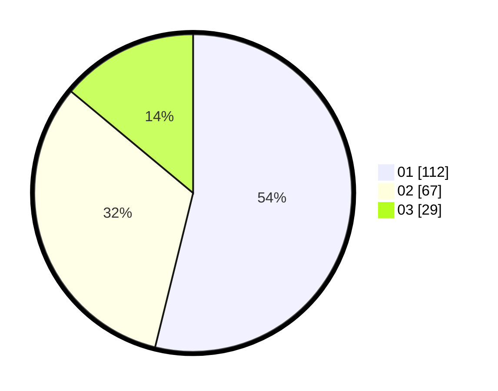

# Hasil

Hasil perolehan suara paslon dapat dilihat pada file paslon-01.txt, paslon-02.txt, dan paslon-03.txt.

Jika tidak ada, artinya data tersebut belum ada pada SIREKAP.

## Perolehan Suara

 * Paslon 01: **112**.
 * Paslon 02: **67**.
 * Paslon 03: **29**.

## Foto C Plano

https://sirekap-obj-formc.kpu.go.id/0333/pemilu/ppwp/31/75/07/10/06/3175071006070-20240214-202828--a93872d1-30a6-4988-a344-943baee4c9f1.jpg

https://sirekap-obj-formc.kpu.go.id/0333/pemilu/ppwp/31/75/07/10/06/3175071006070-20240214-202955--8c19b23f-4e85-4027-9db9-c520474be2b6.jpg

https://sirekap-obj-formc.kpu.go.id/0333/pemilu/ppwp/31/75/07/10/06/3175071006070-20240214-203150--ba2a25cb-b64a-4b5f-a956-d98df2b1959f.jpg

## DATA PEMILIH TETAP

Jumlah pemilih dalam DPT: **268**.
 * L: **133**.
 * P: **135**.

## DATA PENGGUNA HAK PILIH

Jumlah pengguna hak pilih dalam DPT: **207**.
 * L: **98**.
 * P: **109**.

Jumlah pengguna hak pilih dalam DPTb: **4**.
 * L: **2**.
 * P: **2**.

Jumlah pengguna hak pilih dalam DPK: **1**.
 * L: **0**.
 * P: **1**.

Jumlah pengguna hak pilih: **212**.
 * L: **0**.
 * P: **0**.

## JUMLAH SUARA SAH DAN TIDAK SAH

JUMLAH SELURUH SUARA SAH: **708**.

JUMLAH SUARA TIDAK SAH: **4**.

JUMLAH SELURUH SUARA SAH DAN SUARA TIDAK SAH: **712**.
