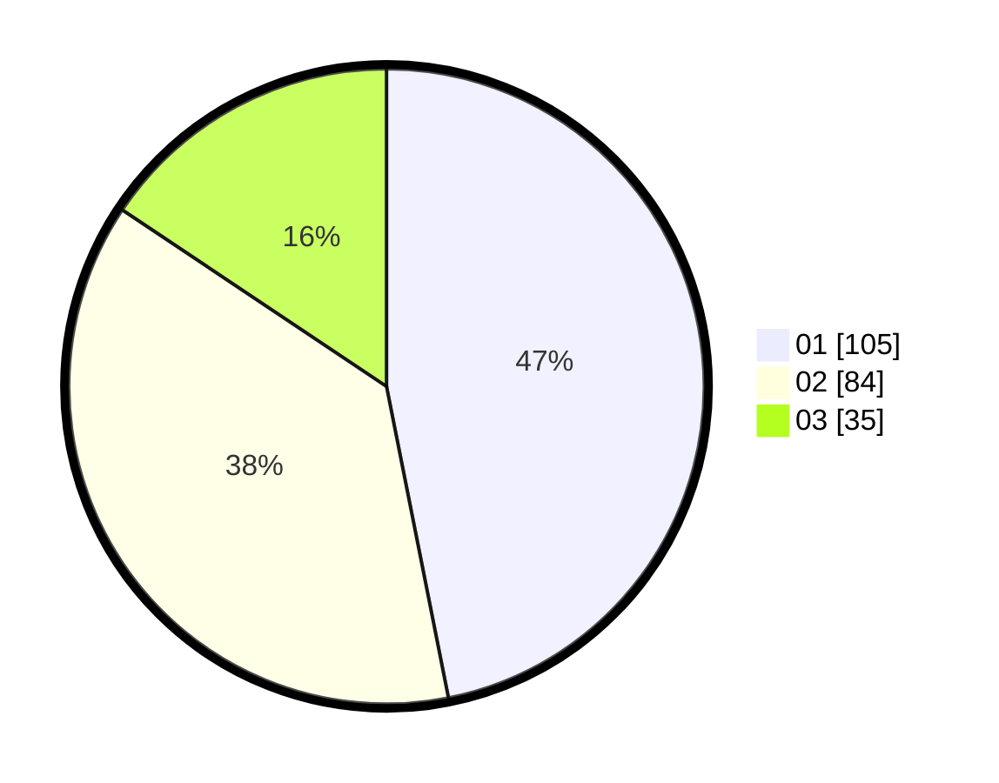

# Hasil

Hasil perolehan suara paslon dapat dilihat pada file paslon-01.txt, paslon-02.txt, dan paslon-03.txt.

Jika tidak ada, artinya data tersebut belum ada pada SIREKAP.

## Perolehan Suara

 * Paslon 01: **105**.
 * Paslon 02: **84**.
 * Paslon 03: **35**.

## Foto C Plano

https://sirekap-obj-formc.kpu.go.id/fcea/pemilu/ppwp/31/75/07/10/06/3175071006071-20240216-145528--068d3685-c4aa-41cd-9598-1f6d03fd6fae.jpg

https://sirekap-obj-formc.kpu.go.id/fcea/pemilu/ppwp/31/75/07/10/06/3175071006071-20240216-145530--850e0184-a1fb-4db1-8510-3e0df90d0e32.jpg

https://sirekap-obj-formc.kpu.go.id/fcea/pemilu/ppwp/31/75/07/10/06/3175071006071-20240216-145529--a2783c96-2811-43b9-8303-d374bbeb29b4.jpg

## DATA PEMILIH TETAP

Jumlah pemilih dalam DPT: **265**.
 * L: **119**.
 * P: **146**.

## DATA PENGGUNA HAK PILIH

Jumlah pengguna hak pilih dalam DPT: **227**.
 * L: **102**.
 * P: **125**.

Jumlah pengguna hak pilih dalam DPTb: **2**.
 * L: **1**.
 * P: **1**.

Jumlah pengguna hak pilih dalam DPK: **1**.
 * L: **0**.
 * P: **1**.

Jumlah pengguna hak pilih: **230**.
 * L: **103**.
 * P: **127**.

## JUMLAH SUARA SAH DAN TIDAK SAH

JUMLAH SELURUH SUARA SAH: **224**.

JUMLAH SUARA TIDAK SAH: **5**.

JUMLAH SELURUH SUARA SAH DAN SUARA TIDAK SAH: **229**.
