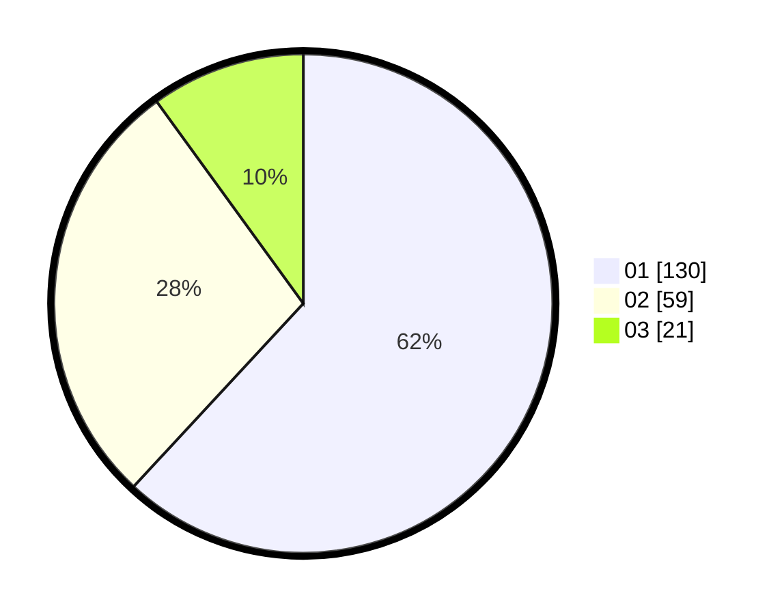

# Hasil

Hasil perolehan suara paslon dapat dilihat pada file paslon-01.txt, paslon-02.txt, dan paslon-03.txt.

Jika tidak ada, artinya data tersebut belum ada pada SIREKAP.

## Perolehan Suara

 * Paslon 01: **130**.
 * Paslon 02: **59**.
 * Paslon 03: **21**.

## Foto C Plano

https://sirekap-obj-formc.kpu.go.id/a5c5/pemilu/ppwp/31/75/07/10/06/3175071006074-20240215-035237--f1120b8f-5754-4c64-b3b5-938d47f453e7.jpg

https://sirekap-obj-formc.kpu.go.id/a5c5/pemilu/ppwp/31/75/07/10/06/3175071006074-20240214-225128--eac0ace2-cbb2-49e7-b30e-86f7a729484f.jpg
