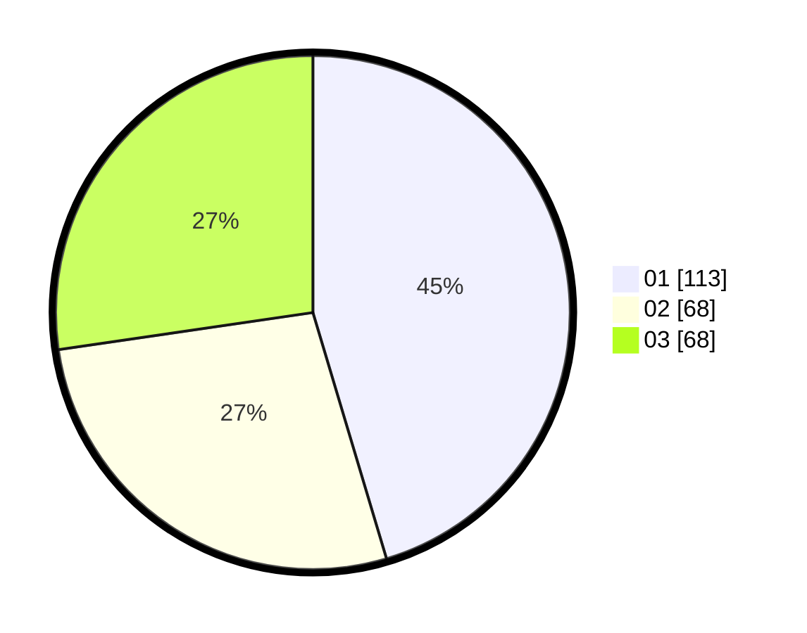

# Hasil

Hasil perolehan suara paslon dapat dilihat pada file paslon-01.txt, paslon-02.txt, dan paslon-03.txt.

Jika tidak ada, artinya data tersebut belum ada pada SIREKAP.

## Perolehan Suara

 * Paslon 01: **113**.
 * Paslon 02: **68**.
 * Paslon 03: **68**.

## Foto C Plano

https://sirekap-obj-formc.kpu.go.id/0d52/pemilu/ppwp/31/75/07/10/06/3175071006076-20240214-223032--dbbe5cf1-44ff-44ab-807b-9afa2292307c.jpg

https://sirekap-obj-formc.kpu.go.id/0d52/pemilu/ppwp/31/75/07/10/06/3175071006076-20240214-211845--42dc3a50-99cf-4a6d-96fc-944882e3af62.jpg

https://sirekap-obj-formc.kpu.go.id/0d52/pemilu/ppwp/31/75/07/10/06/3175071006076-20240214-223137--90e7ad82-f2b0-4413-97a5-ca89ff6da80a.jpg
