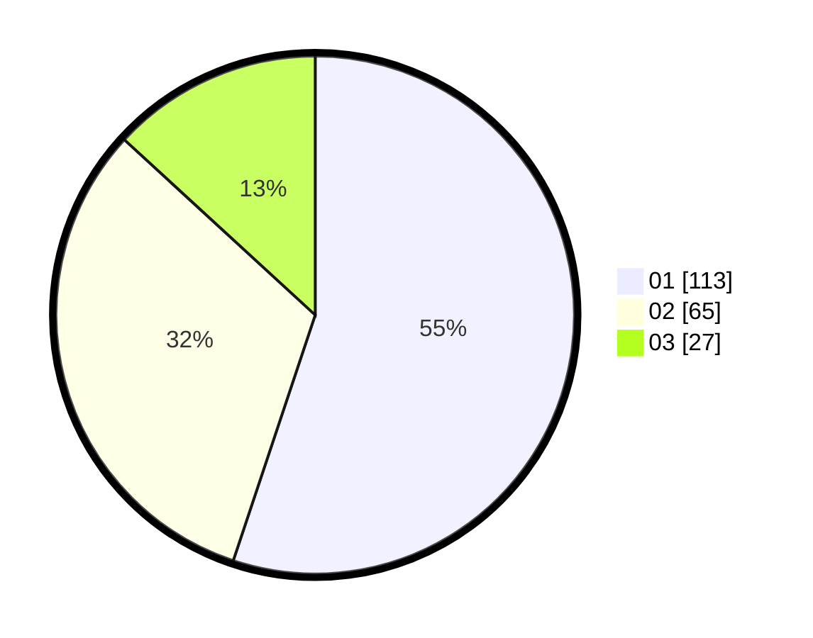

# Hasil

Hasil perolehan suara paslon dapat dilihat pada file paslon-01.txt, paslon-02.txt, dan paslon-03.txt.

Jika tidak ada, artinya data tersebut belum ada pada SIREKAP.

## Perolehan Suara

 * Paslon 01: **113**.
 * Paslon 02: **65**.
 * Paslon 03: **27**.

## Foto C Plano

https://sirekap-obj-formc.kpu.go.id/c756/pemilu/ppwp/31/75/07/10/06/3175071006077-20240216-012739--feea3d26-9b9a-4a85-ac4a-04f6ea87c3a3.jpg

https://sirekap-obj-formc.kpu.go.id/c756/pemilu/ppwp/31/75/07/10/06/3175071006077-20240216-012747--8d030d79-3ee5-49e1-90ea-3982e7ac6723.jpg

https://sirekap-obj-formc.kpu.go.id/c756/pemilu/ppwp/31/75/07/10/06/3175071006077-20240216-012744--3f35fb86-52b2-4fc0-961d-e3349b9d22e6.jpg

## DATA PEMILIH TETAP

Jumlah pemilih dalam DPT: **246**.
 * L: **116**.
 * P: **130**.

## DATA PENGGUNA HAK PILIH

Jumlah pengguna hak pilih dalam DPT: **207**.
 * L: **98**.
 * P: **109**.

Jumlah pengguna hak pilih dalam DPTb: **0**.
 * L: **0**.
 * P: **0**.

Jumlah pengguna hak pilih dalam DPK: **2**.
 * L: **1**.
 * P: **1**.

Jumlah pengguna hak pilih: **209**.
 * L: **99**.
 * P: **110**.

## JUMLAH SUARA SAH DAN TIDAK SAH

JUMLAH SELURUH SUARA SAH: **205**.

JUMLAH SUARA TIDAK SAH: **4**.

JUMLAH SELURUH SUARA SAH DAN SUARA TIDAK SAH: **209**.
