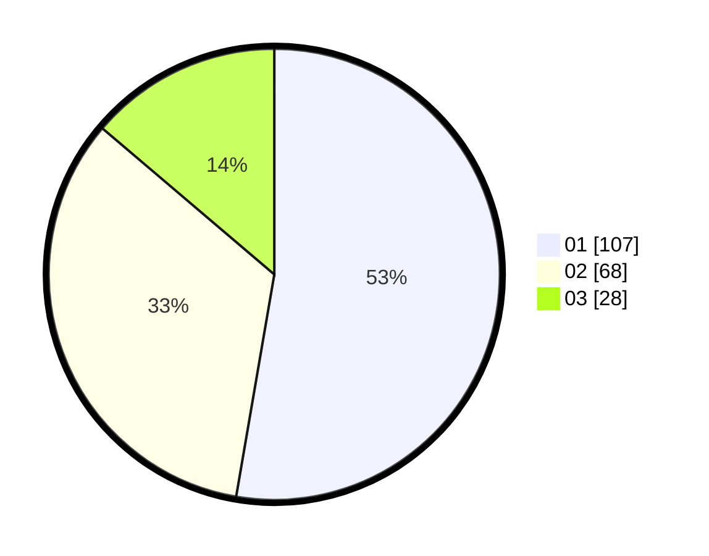

# Hasil

Hasil perolehan suara paslon dapat dilihat pada file paslon-01.txt, paslon-02.txt, dan paslon-03.txt.

Jika tidak ada, artinya data tersebut belum ada pada SIREKAP.

## Perolehan Suara

 * Paslon 01: **107**.
 * Paslon 02: **68**.
 * Paslon 03: **28**.

## Foto C Plano

https://sirekap-obj-formc.kpu.go.id/a9f9/pemilu/ppwp/31/75/07/10/06/3175071006079-20240214-192808--b6cb129e-cbf2-4252-ad4a-eca01cec603e.jpg

https://sirekap-obj-formc.kpu.go.id/a9f9/pemilu/ppwp/31/75/07/10/06/3175071006079-20240214-210951--787dc4de-cb28-46a1-a207-138e3443c9c4.jpg

https://sirekap-obj-formc.kpu.go.id/a9f9/pemilu/ppwp/31/75/07/10/06/3175071006079-20240214-192844--b44b9ac9-783b-4834-99c3-81dea53204d1.jpg

## DATA PEMILIH TETAP

Jumlah pemilih dalam DPT: **262**.
 * L: **127**.
 * P: **135**.

## DATA PENGGUNA HAK PILIH

Jumlah pengguna hak pilih dalam DPT: **205**.
 * L: **96**.
 * P: **109**.

Jumlah pengguna hak pilih dalam DPTb: **0**.
 * L: **0**.
 * P: **0**.

Jumlah pengguna hak pilih dalam DPK: **0**.
 * L: **0**.
 * P: **0**.

Jumlah pengguna hak pilih: **205**.
 * L: **96**.
 * P: **109**.

## JUMLAH SUARA SAH DAN TIDAK SAH

JUMLAH SELURUH SUARA SAH: **203**.

JUMLAH SUARA TIDAK SAH: **2**.

JUMLAH SELURUH SUARA SAH DAN SUARA TIDAK SAH: **205**.
