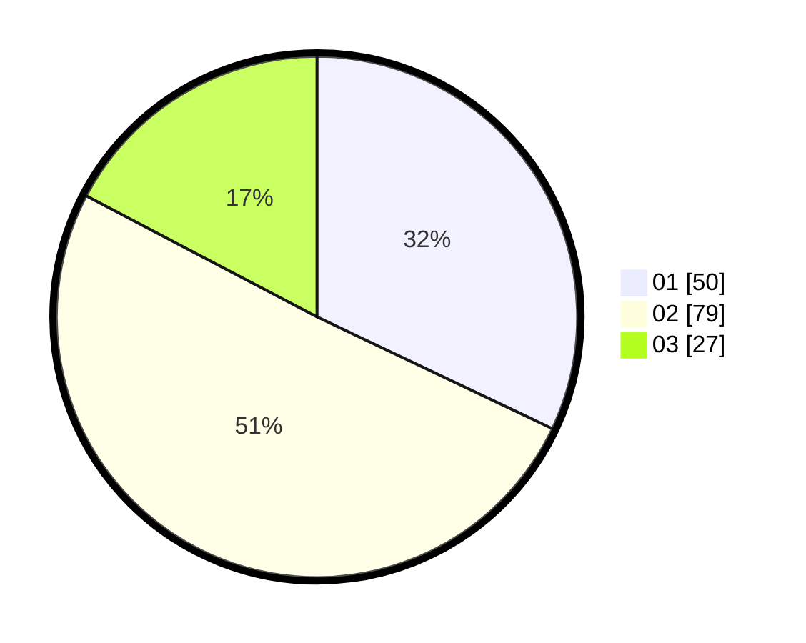

# Hasil

Hasil perolehan suara paslon dapat dilihat pada file paslon-01.txt, paslon-02.txt, dan paslon-03.txt.

Jika tidak ada, artinya data tersebut belum ada pada SIREKAP.

## Perolehan Suara

 * Paslon 01: **50**.
 * Paslon 02: **79**.
 * Paslon 03: **27**.

## Foto C Plano

https://sirekap-obj-formc.kpu.go.id/3d56/pemilu/ppwp/31/75/07/10/06/3175071006081-20240214-192436--e14e8051-a42e-421d-88d3-34577f21dc2c.jpg

https://sirekap-obj-formc.kpu.go.id/3d56/pemilu/ppwp/31/75/07/10/06/3175071006081-20240214-192519--24bed2a8-1cfb-4fa1-9b01-df8c845831cb.jpg

https://sirekap-obj-formc.kpu.go.id/3d56/pemilu/ppwp/31/75/07/10/06/3175071006081-20240214-192326--4aefe35c-a005-45d7-a36d-beed2b5413f9.jpg

## DATA PEMILIH TETAP

Jumlah pemilih dalam DPT: **221**.
 * L: **120**.
 * P: **101**.

## DATA PENGGUNA HAK PILIH

Jumlah pengguna hak pilih dalam DPT: **155**.
 * L: **76**.
 * P: **79**.

Jumlah pengguna hak pilih dalam DPTb: **0**.
 * L: **0**.
 * P: **0**.

Jumlah pengguna hak pilih dalam DPK: **1**.
 * L: **1**.
 * P: **0**.

Jumlah pengguna hak pilih: **156**.
 * L: **77**.
 * P: **79**.

## JUMLAH SUARA SAH DAN TIDAK SAH

JUMLAH SELURUH SUARA SAH: **156**.

JUMLAH SUARA TIDAK SAH: **1**.

JUMLAH SELURUH SUARA SAH DAN SUARA TIDAK SAH: **157**.
