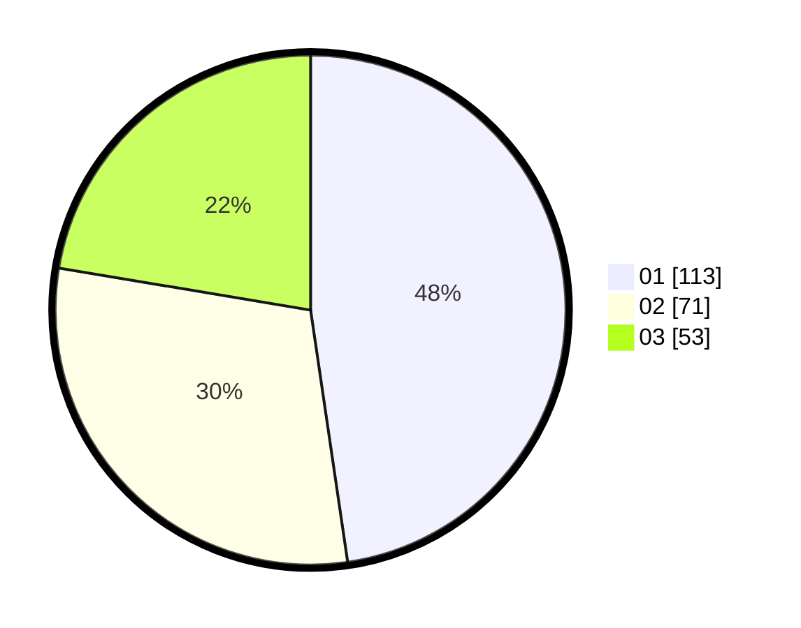

# Hasil

Hasil perolehan suara paslon dapat dilihat pada file paslon-01.txt, paslon-02.txt, dan paslon-03.txt.

Jika tidak ada, artinya data tersebut belum ada pada SIREKAP.

## Perolehan Suara

 * Paslon 01: **113**.
 * Paslon 02: **71**.
 * Paslon 03: **53**.

## Foto C Plano

https://sirekap-obj-formc.kpu.go.id/f916/pemilu/ppwp/31/75/07/10/06/3175071006083-20240216-123244--6e3f2580-1551-444b-b9ea-21fa2c04d502.jpg

https://sirekap-obj-formc.kpu.go.id/f916/pemilu/ppwp/31/75/07/10/06/3175071006083-20240216-123248--ec3797d1-b5ed-4c56-a533-55ce58b23f6d.jpg

https://sirekap-obj-formc.kpu.go.id/f916/pemilu/ppwp/31/75/07/10/06/3175071006083-20240216-123245--dcc88160-2b7e-49f2-b914-0204e8c5b5ca.jpg

## DATA PEMILIH TETAP

Jumlah pemilih dalam DPT: **276**.
 * L: **132**.
 * P: **144**.

## DATA PENGGUNA HAK PILIH

Jumlah pengguna hak pilih dalam DPT: **233**.
 * L: **106**.
 * P: **127**.

Jumlah pengguna hak pilih dalam DPTb: **4**.
 * L: **2**.
 * P: **2**.

Jumlah pengguna hak pilih dalam DPK: **0**.
 * L: **0**.
 * P: **0**.

Jumlah pengguna hak pilih: **237**.
 * L: **108**.
 * P: **129**.

## JUMLAH SUARA SAH DAN TIDAK SAH

JUMLAH SELURUH SUARA SAH: **237**.

JUMLAH SUARA TIDAK SAH: **0**.

JUMLAH SELURUH SUARA SAH DAN SUARA TIDAK SAH: **237**.
