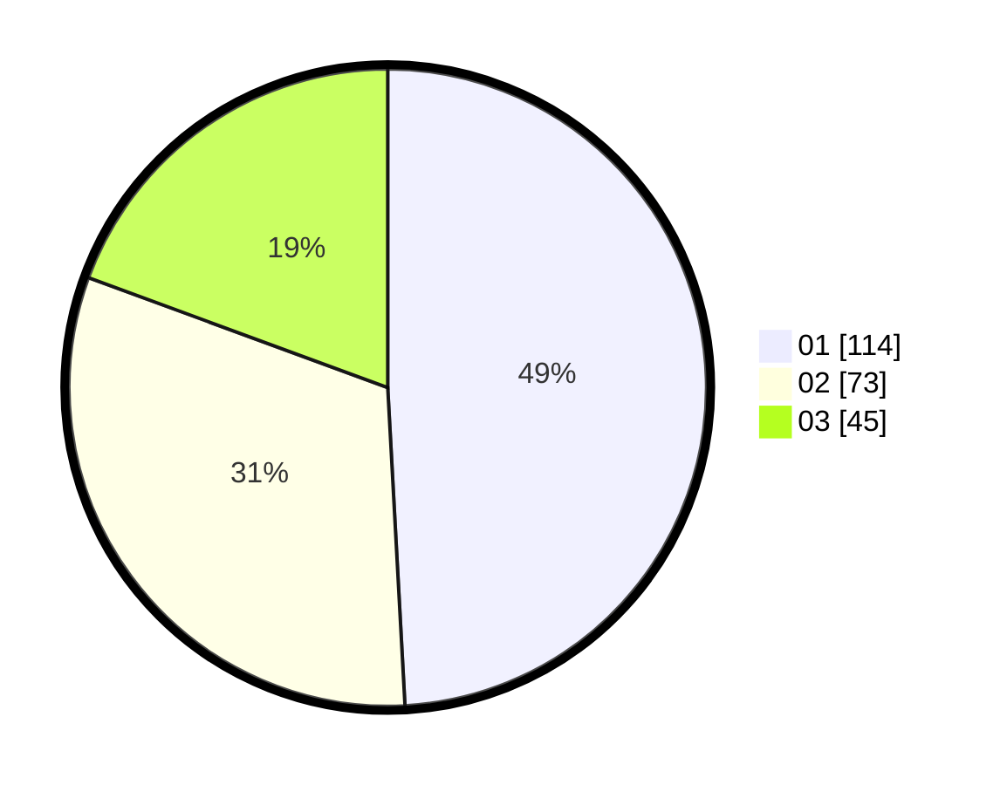

# Hasil

Hasil perolehan suara paslon dapat dilihat pada file paslon-01.txt, paslon-02.txt, dan paslon-03.txt.

Jika tidak ada, artinya data tersebut belum ada pada SIREKAP.

## Perolehan Suara

 * Paslon 01: **114**.
 * Paslon 02: **73**.
 * Paslon 03: **45**.

## Foto C Plano

https://sirekap-obj-formc.kpu.go.id/17cd/pemilu/ppwp/31/75/07/10/06/3175071006085-20240214-201731--222c15dd-6e29-4e6d-a18b-f40c464ecc82.jpg

https://sirekap-obj-formc.kpu.go.id/17cd/pemilu/ppwp/31/75/07/10/06/3175071006085-20240214-202030--99a77924-821c-4d0f-addb-90361914b433.jpg

https://sirekap-obj-formc.kpu.go.id/17cd/pemilu/ppwp/31/75/07/10/06/3175071006085-20240214-204810--2ab4875b-77cc-41f2-b16c-8c7368377984.jpg

## DATA PEMILIH TETAP

Jumlah pemilih dalam DPT: **269**.
 * L: **121**.
 * P: **148**.

## DATA PENGGUNA HAK PILIH

Jumlah pengguna hak pilih dalam DPT: **229**.
 * L: **95**.
 * P: **134**.

Jumlah pengguna hak pilih dalam DPTb: **0**.
 * L: **0**.
 * P: **0**.

Jumlah pengguna hak pilih dalam DPK: **4**.
 * L: **0**.
 * P: **4**.

Jumlah pengguna hak pilih: **233**.
 * L: **95**.
 * P: **138**.

## JUMLAH SUARA SAH DAN TIDAK SAH

JUMLAH SELURUH SUARA SAH: **232**.

JUMLAH SUARA TIDAK SAH: **1**.

JUMLAH SELURUH SUARA SAH DAN SUARA TIDAK SAH: **233**.
