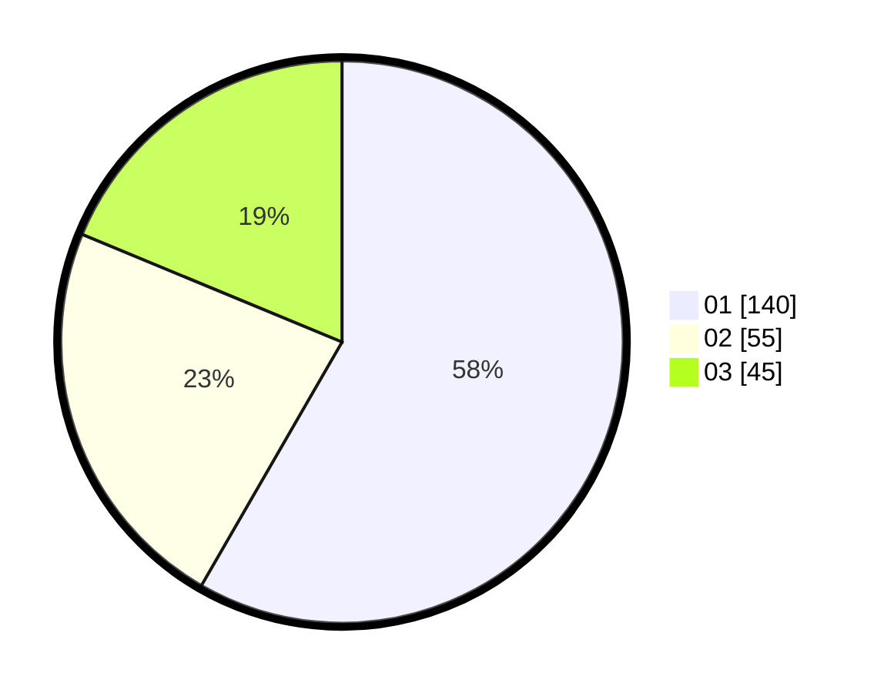

# Hasil

Hasil perolehan suara paslon dapat dilihat pada file paslon-01.txt, paslon-02.txt, dan paslon-03.txt.

Jika tidak ada, artinya data tersebut belum ada pada SIREKAP.

## Perolehan Suara

 * Paslon 01: **140**.
 * Paslon 02: **55**.
 * Paslon 03: **45**.

## Foto C Plano

https://sirekap-obj-formc.kpu.go.id/4dc9/pemilu/ppwp/31/75/07/10/06/3175071006086-20240214-185752--09a315f3-be61-42a7-8663-9510da5f23c0.jpg

https://sirekap-obj-formc.kpu.go.id/4dc9/pemilu/ppwp/31/75/07/10/06/3175071006086-20240214-185501--13f6a205-1a41-41c1-bebb-0adc1d7761e0.jpg

https://sirekap-obj-formc.kpu.go.id/4dc9/pemilu/ppwp/31/75/07/10/06/3175071006086-20240214-185511--25323f48-90cb-42e7-bad9-ff9ce554263f.jpg
