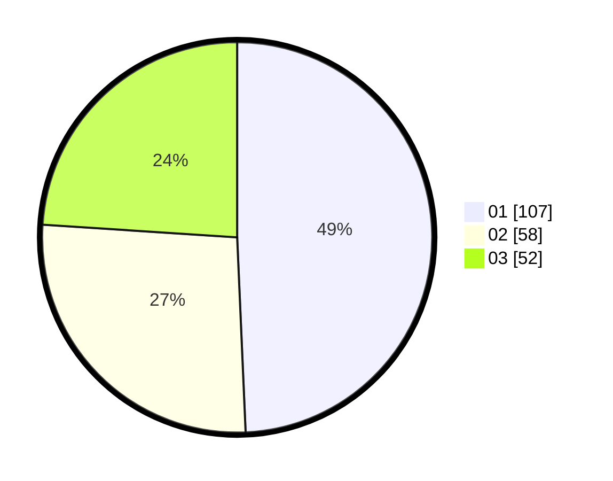

# Hasil

Hasil perolehan suara paslon dapat dilihat pada file paslon-01.txt, paslon-02.txt, dan paslon-03.txt.

Jika tidak ada, artinya data tersebut belum ada pada SIREKAP.

## Perolehan Suara

 * Paslon 01: **107**.
 * Paslon 02: **58**.
 * Paslon 03: **52**.

## Foto C Plano

https://sirekap-obj-formc.kpu.go.id/2e9d/pemilu/ppwp/31/75/07/10/06/3175071006089-20240214-221607--21ee6afa-b3ec-4bb4-8689-214733fddb1b.jpg

https://sirekap-obj-formc.kpu.go.id/2e9d/pemilu/ppwp/31/75/07/10/06/3175071006089-20240214-221811--50ca202e-0617-4d6b-bb98-d404d7915c0e.jpg

https://sirekap-obj-formc.kpu.go.id/2e9d/pemilu/ppwp/31/75/07/10/06/3175071006089-20240214-221952--60663563-38e9-4fe6-bc76-de66660bca9f.jpg
