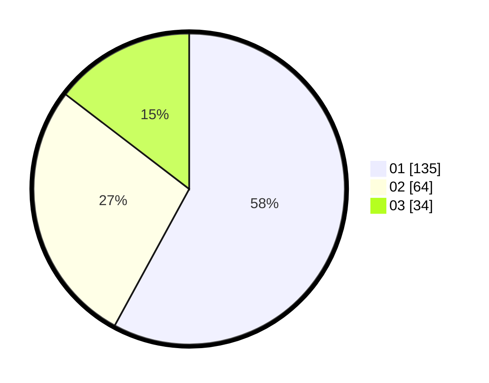

# Hasil

Hasil perolehan suara paslon dapat dilihat pada file paslon-01.txt, paslon-02.txt, dan paslon-03.txt.

Jika tidak ada, artinya data tersebut belum ada pada SIREKAP.

## Perolehan Suara

 * Paslon 01: **135**.
 * Paslon 02: **64**.
 * Paslon 03: **34**.

## Foto C Plano

https://sirekap-obj-formc.kpu.go.id/5565/pemilu/ppwp/31/75/07/10/06/3175071006090-20240214-193635--ab7ca056-d772-40b3-acb0-b778c8c277a0.jpg

https://sirekap-obj-formc.kpu.go.id/5565/pemilu/ppwp/31/75/07/10/06/3175071006090-20240214-193641--311098c9-f809-46cc-8456-af03cc8f2312.jpg

https://sirekap-obj-formc.kpu.go.id/5565/pemilu/ppwp/31/75/07/10/06/3175071006090-20240214-193646--58165977-63e5-4a24-a71d-1ef6d8888ff8.jpg

## DATA PEMILIH TETAP

Jumlah pemilih dalam DPT: **273**.
 * L: **123**.
 * P: **150**.

## DATA PENGGUNA HAK PILIH

Jumlah pengguna hak pilih dalam DPT: **226**.
 * L: **99**.
 * P: **127**.

Jumlah pengguna hak pilih dalam DPTb: **8**.
 * L: **5**.
 * P: **3**.

Jumlah pengguna hak pilih dalam DPK: **5**.
 * L: **3**.
 * P: **2**.

Jumlah pengguna hak pilih: **239**.
 * L: **107**.
 * P: **132**.

## JUMLAH SUARA SAH DAN TIDAK SAH

JUMLAH SELURUH SUARA SAH: **234**.

JUMLAH SUARA TIDAK SAH: **5**.

JUMLAH SELURUH SUARA SAH DAN SUARA TIDAK SAH: **239**.
