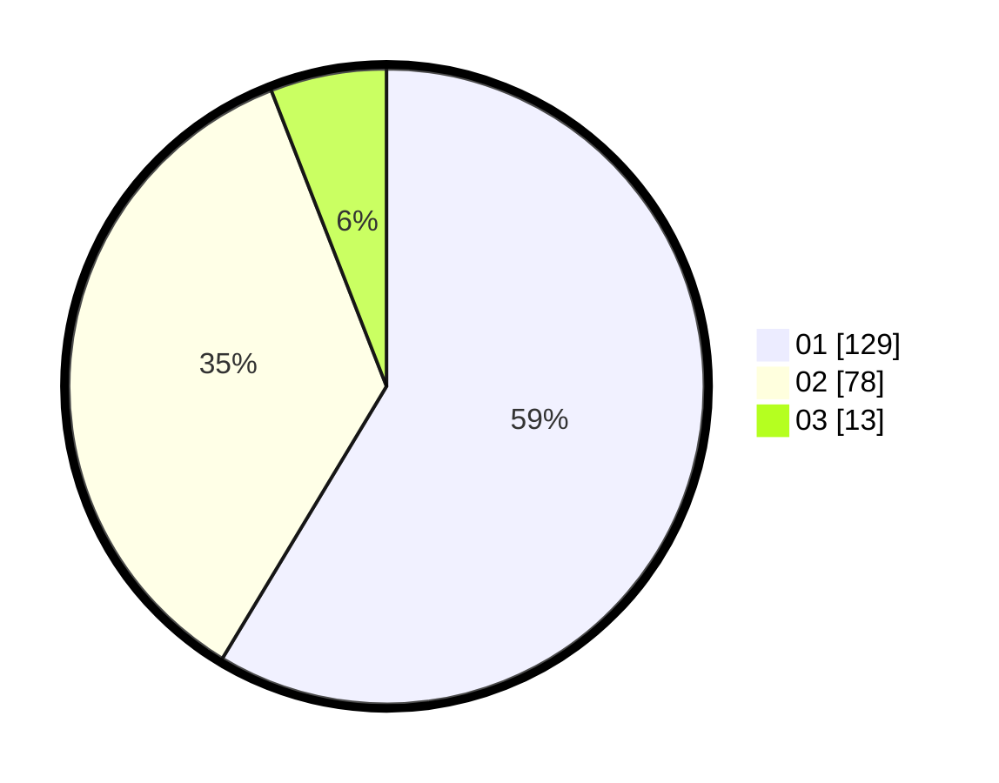

# Hasil

Hasil perolehan suara paslon dapat dilihat pada file paslon-01.txt, paslon-02.txt, dan paslon-03.txt.

Jika tidak ada, artinya data tersebut belum ada pada SIREKAP.

## Perolehan Suara

 * Paslon 01: **129**.
 * Paslon 02: **78**.
 * Paslon 03: **13**.

## Foto C Plano

https://sirekap-obj-formc.kpu.go.id/934f/pemilu/ppwp/31/75/07/10/06/3175071006093-20240214-155501--490d7f8f-6279-4d7a-b0ae-2cf92dca894e.jpg

https://sirekap-obj-formc.kpu.go.id/934f/pemilu/ppwp/31/75/07/10/06/3175071006093-20240214-155554--a5717e24-5e90-4f9d-b9c4-7a97343e6496.jpg

https://sirekap-obj-formc.kpu.go.id/934f/pemilu/ppwp/31/75/07/10/06/3175071006093-20240214-160056--554bf520-aff7-4b07-9ada-8e19fbd0105b.jpg

## DATA PEMILIH TETAP

Jumlah pemilih dalam DPT: **273**.
 * L: **124**.
 * P: **149**.

## DATA PENGGUNA HAK PILIH

Jumlah pengguna hak pilih dalam DPT: **224**.
 * L: **101**.
 * P: **123**.

Jumlah pengguna hak pilih dalam DPTb: **1**.
 * L: **0**.
 * P: **1**.

Jumlah pengguna hak pilih dalam DPK: **1**.
 * L: **1**.
 * P: **0**.

Jumlah pengguna hak pilih: **226**.
 * L: **102**.
 * P: **124**.

## JUMLAH SUARA SAH DAN TIDAK SAH

JUMLAH SELURUH SUARA SAH: **220**.

JUMLAH SUARA TIDAK SAH: **6**.

JUMLAH SELURUH SUARA SAH DAN SUARA TIDAK SAH: **226**.
