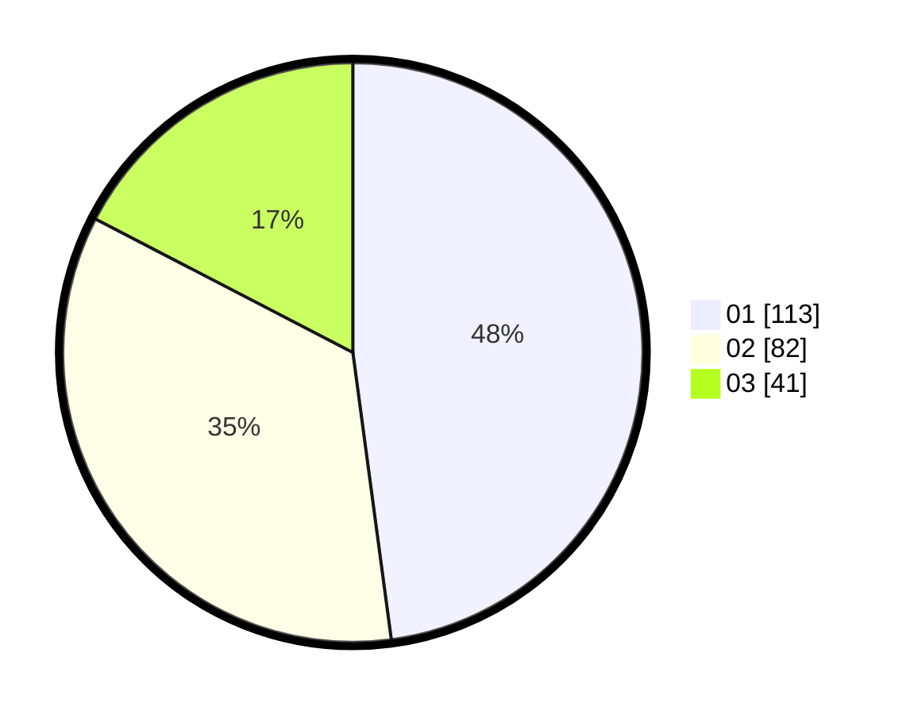

# Hasil

Hasil perolehan suara paslon dapat dilihat pada file paslon-01.txt, paslon-02.txt, dan paslon-03.txt.

Jika tidak ada, artinya data tersebut belum ada pada SIREKAP.

## Perolehan Suara

 * Paslon 01: **113**.
 * Paslon 02: **82**.
 * Paslon 03: **41**.

## Foto C Plano

https://sirekap-obj-formc.kpu.go.id/76ab/pemilu/ppwp/31/75/07/10/06/3175071006103-20240214-200455--daadac53-1b8f-414a-bad0-a44c079561cf.jpg

https://sirekap-obj-formc.kpu.go.id/76ab/pemilu/ppwp/31/75/07/10/06/3175071006103-20240214-200509--aa674fd0-321f-4cb6-b8b4-6856ebc56c7d.jpg

https://sirekap-obj-formc.kpu.go.id/76ab/pemilu/ppwp/31/75/07/10/06/3175071006103-20240214-200527--70e68d35-31f8-43a3-85bf-dc860f02568c.jpg

## DATA PEMILIH TETAP

Jumlah pemilih dalam DPT: **269**.
 * L: **137**.
 * P: **132**.

## DATA PENGGUNA HAK PILIH

Jumlah pengguna hak pilih dalam DPT: **232**.
 * L: **112**.
 * P: **120**.

Jumlah pengguna hak pilih dalam DPTb: **0**.
 * L: **0**.
 * P: **0**.

Jumlah pengguna hak pilih dalam DPK: **11**.
 * L: **1**.
 * P: **10**.

Jumlah pengguna hak pilih: **243**.
 * L: **113**.
 * P: **130**.

## JUMLAH SUARA SAH DAN TIDAK SAH

JUMLAH SELURUH SUARA SAH: **236**.

JUMLAH SUARA TIDAK SAH: **7**.

JUMLAH SELURUH SUARA SAH DAN SUARA TIDAK SAH: **243**.
