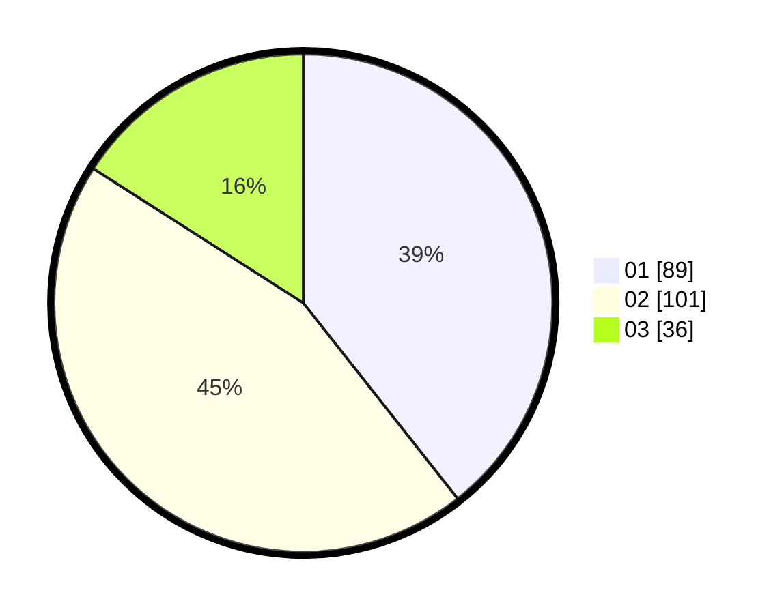

# Hasil

Hasil perolehan suara paslon dapat dilihat pada file paslon-01.txt, paslon-02.txt, dan paslon-03.txt.

Jika tidak ada, artinya data tersebut belum ada pada SIREKAP.

## Perolehan Suara

 * Paslon 01: **89**.
 * Paslon 02: **101**.
 * Paslon 03: **36**.

## Foto C Plano

https://sirekap-obj-formc.kpu.go.id/d56b/pemilu/ppwp/31/75/07/10/06/3175071006104-20240216-143912--9b7e2cec-7114-4cb7-8c0f-44111c013208.jpg

https://sirekap-obj-formc.kpu.go.id/d56b/pemilu/ppwp/31/75/07/10/06/3175071006104-20240216-143913--40dad0f5-9b37-437d-b53e-447e6dfd86ac.jpg

https://sirekap-obj-formc.kpu.go.id/d56b/pemilu/ppwp/31/75/07/10/06/3175071006104-20240216-143912--0a26c4bf-a7ac-4599-8441-b1b7f3e928a1.jpg

## DATA PEMILIH TETAP

Jumlah pemilih dalam DPT: **271**.
 * L: **120**.
 * P: **151**.

## DATA PENGGUNA HAK PILIH

Jumlah pengguna hak pilih dalam DPT: **227**.
 * L: **93**.
 * P: **134**.

Jumlah pengguna hak pilih dalam DPTb: **0**.
 * L: **0**.
 * P: **0**.

Jumlah pengguna hak pilih dalam DPK: **0**.
 * L: **0**.
 * P: **0**.

Jumlah pengguna hak pilih: **227**.
 * L: **93**.
 * P: **134**.

## JUMLAH SUARA SAH DAN TIDAK SAH

JUMLAH SELURUH SUARA SAH: **226**.

JUMLAH SUARA TIDAK SAH: **1**.

JUMLAH SELURUH SUARA SAH DAN SUARA TIDAK SAH: **227**.
