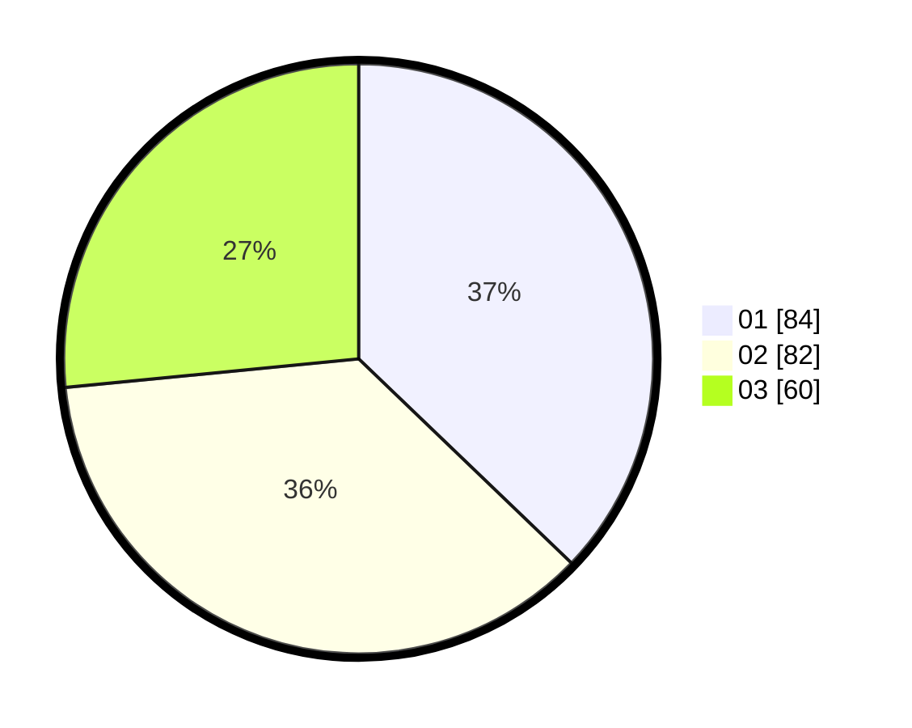

# Hasil

Hasil perolehan suara paslon dapat dilihat pada file paslon-01.txt, paslon-02.txt, dan paslon-03.txt.

Jika tidak ada, artinya data tersebut belum ada pada SIREKAP.

## Perolehan Suara

 * Paslon 01: **84**.
 * Paslon 02: **82**.
 * Paslon 03: **60**.

## Foto C Plano

https://sirekap-obj-formc.kpu.go.id/7048/pemilu/ppwp/31/75/07/10/07/3175071007004-20240215-152022--f8935f3d-17fb-4000-b6be-b53d5224c6cb.jpg

https://sirekap-obj-formc.kpu.go.id/7048/pemilu/ppwp/31/75/07/10/07/3175071007004-20240215-152044--1018dafd-d3a4-4c07-a8f9-d0f35492a979.jpg

https://sirekap-obj-formc.kpu.go.id/7048/pemilu/ppwp/31/75/07/10/07/3175071007004-20240215-152033--e7cf1034-3f3c-4f86-acc4-149e2c30d48f.jpg

## DATA PEMILIH TETAP

Jumlah pemilih dalam DPT: **275**.
 * L: **133**.
 * P: **142**.

## DATA PENGGUNA HAK PILIH

Jumlah pengguna hak pilih dalam DPT: **224**.
 * L: **109**.
 * P: **115**.

Jumlah pengguna hak pilih dalam DPTb: **6**.
 * L: **3**.
 * P: **3**.

Jumlah pengguna hak pilih dalam DPK: **0**.
 * L: **0**.
 * P: **0**.

Jumlah pengguna hak pilih: **230**.
 * L: **112**.
 * P: **118**.

## JUMLAH SUARA SAH DAN TIDAK SAH

JUMLAH SELURUH SUARA SAH: **226**.

JUMLAH SUARA TIDAK SAH: **4**.

JUMLAH SELURUH SUARA SAH DAN SUARA TIDAK SAH: **230**.
