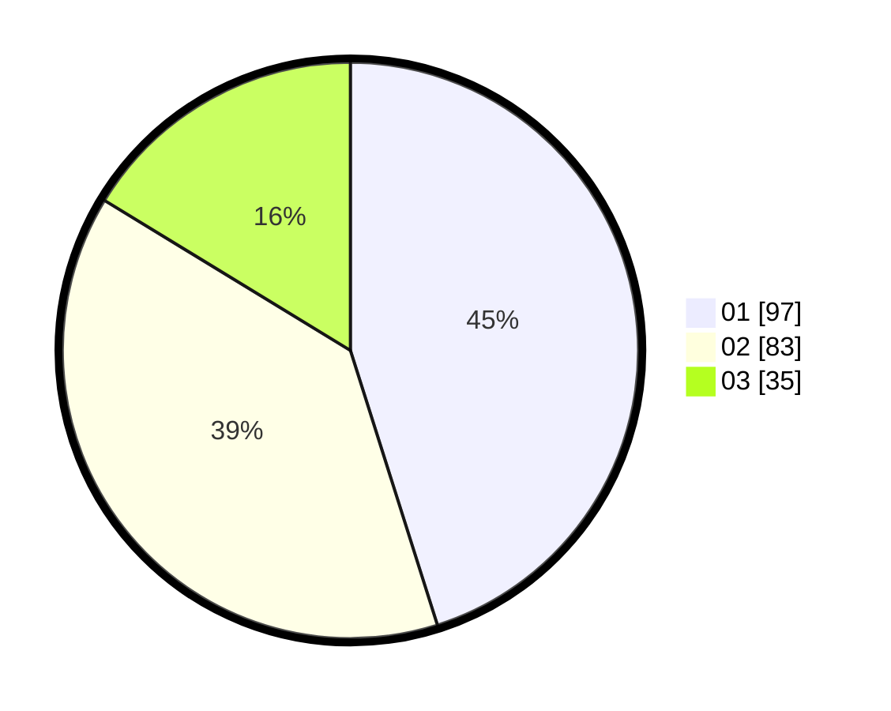

# Hasil

Hasil perolehan suara paslon dapat dilihat pada file paslon-01.txt, paslon-02.txt, dan paslon-03.txt.

Jika tidak ada, artinya data tersebut belum ada pada SIREKAP.

## Perolehan Suara

 * Paslon 01: **97**.
 * Paslon 02: **83**.
 * Paslon 03: **35**.

## Foto C Plano

https://sirekap-obj-formc.kpu.go.id/361a/pemilu/ppwp/31/75/07/10/07/3175071007005-20240216-141859--a16d6f7c-d5e5-4280-a02a-66bf31d99ace.jpg

https://sirekap-obj-formc.kpu.go.id/361a/pemilu/ppwp/31/75/07/10/07/3175071007005-20240216-141901--7e24f87a-7f9e-4bc6-ab55-f2534c2a1bdb.jpg

https://sirekap-obj-formc.kpu.go.id/361a/pemilu/ppwp/31/75/07/10/07/3175071007005-20240216-141900--d8d690ba-9a07-4505-b34a-d8caecd9fc7a.jpg

## DATA PEMILIH TETAP

Jumlah pemilih dalam DPT: **277**.
 * L: **120**.
 * P: **157**.

## DATA PENGGUNA HAK PILIH

Jumlah pengguna hak pilih dalam DPT: **217**.
 * L: **90**.
 * P: **127**.

Jumlah pengguna hak pilih dalam DPTb: **5**.
 * L: **2**.
 * P: **3**.

Jumlah pengguna hak pilih dalam DPK: **0**.
 * L: **0**.
 * P: **0**.

Jumlah pengguna hak pilih: **222**.
 * L: **92**.
 * P: **130**.

## JUMLAH SUARA SAH DAN TIDAK SAH

JUMLAH SELURUH SUARA SAH: **215**.

JUMLAH SUARA TIDAK SAH: **7**.

JUMLAH SELURUH SUARA SAH DAN SUARA TIDAK SAH: **222**.
