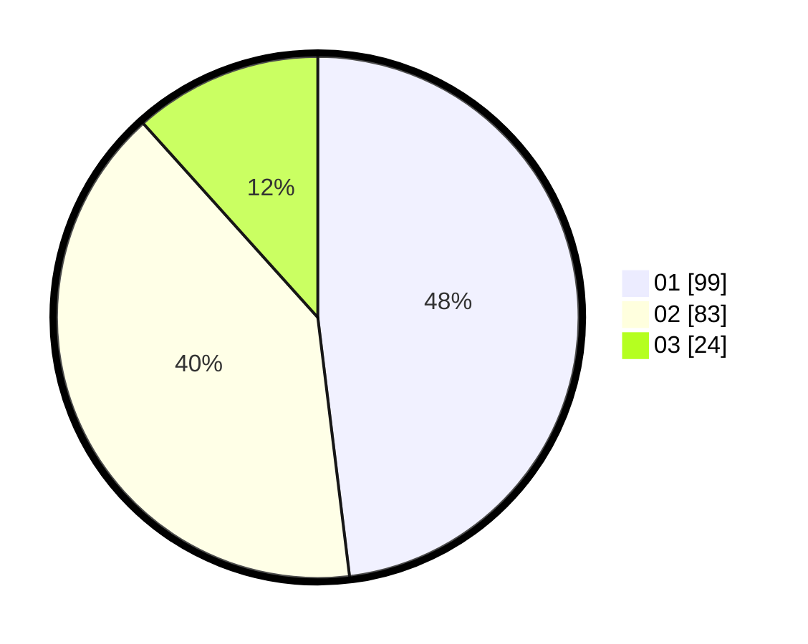

# Hasil

Hasil perolehan suara paslon dapat dilihat pada file paslon-01.txt, paslon-02.txt, dan paslon-03.txt.

Jika tidak ada, artinya data tersebut belum ada pada SIREKAP.

## Perolehan Suara

 * Paslon 01: **99**.
 * Paslon 02: **83**.
 * Paslon 03: **24**.

## Foto C Plano

https://sirekap-obj-formc.kpu.go.id/ae4c/pemilu/ppwp/31/75/07/10/07/3175071007011-20240214-194853--7eb04849-d6b3-486a-81ac-7069f2578aea.jpg

https://sirekap-obj-formc.kpu.go.id/ae4c/pemilu/ppwp/31/75/07/10/07/3175071007011-20240215-015351--3f07d90b-5666-4635-902e-441f9fa7733b.jpg

https://sirekap-obj-formc.kpu.go.id/ae4c/pemilu/ppwp/31/75/07/10/07/3175071007011-20240216-134635--9d371537-640f-42a1-b153-0697bac696cd.jpg
