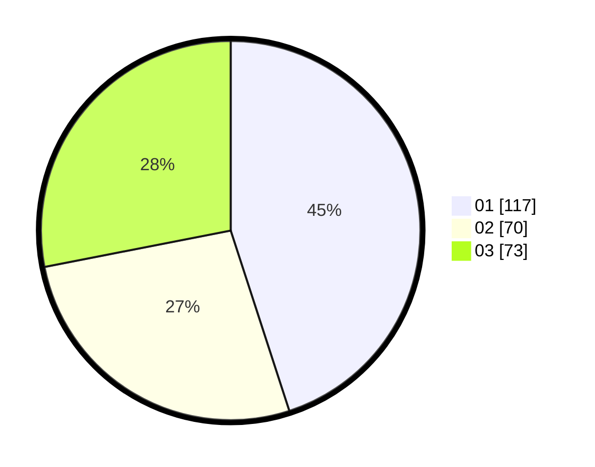

# Hasil

Hasil perolehan suara paslon dapat dilihat pada file paslon-01.txt, paslon-02.txt, dan paslon-03.txt.

Jika tidak ada, artinya data tersebut belum ada pada SIREKAP.

## Perolehan Suara

 * Paslon 01: **117**.
 * Paslon 02: **70**.
 * Paslon 03: **73**.

## Foto C Plano

https://sirekap-obj-formc.kpu.go.id/effd/pemilu/ppwp/31/75/07/10/07/3175071007012-20240214-191040--ebe40656-a510-438b-a342-1a6a3e73a32b.jpg

https://sirekap-obj-formc.kpu.go.id/effd/pemilu/ppwp/31/75/07/10/07/3175071007012-20240214-191131--b98755ae-065d-489b-96af-1ff31f95e28c.jpg

https://sirekap-obj-formc.kpu.go.id/effd/pemilu/ppwp/31/75/07/10/07/3175071007012-20240214-191152--680220cc-0f10-4253-94fc-851b1c551004.jpg

## DATA PEMILIH TETAP

Jumlah pemilih dalam DPT: **285**.
 * L: **141**.
 * P: **144**.

## DATA PENGGUNA HAK PILIH

Jumlah pengguna hak pilih dalam DPT: **285**.
 * L: **141**.
 * P: **144**.

Jumlah pengguna hak pilih dalam DPTb: **4**.
 * L: **2**.
 * P: **2**.

Jumlah pengguna hak pilih dalam DPK: **0**.
 * L: **0**.
 * P: **0**.

Jumlah pengguna hak pilih: **224**.
 * L: **110**.
 * P: **114**.

## JUMLAH SUARA SAH DAN TIDAK SAH

JUMLAH SELURUH SUARA SAH: **220**.

JUMLAH SUARA TIDAK SAH: **4**.

JUMLAH SELURUH SUARA SAH DAN SUARA TIDAK SAH: **224**.
