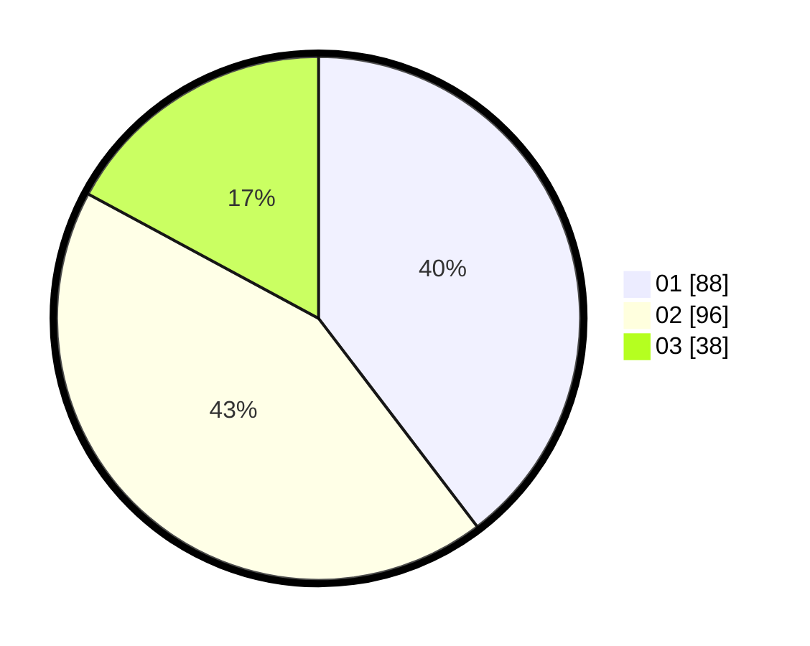

# Hasil

Hasil perolehan suara paslon dapat dilihat pada file paslon-01.txt, paslon-02.txt, dan paslon-03.txt.

Jika tidak ada, artinya data tersebut belum ada pada SIREKAP.

## Perolehan Suara

 * Paslon 01: **88**.
 * Paslon 02: **96**.
 * Paslon 03: **38**.

## Foto C Plano

https://sirekap-obj-formc.kpu.go.id/fe07/pemilu/ppwp/31/75/07/10/07/3175071007018-20240216-144512--a87fae4c-6b49-40df-b15e-63118892d9f8.jpg

https://sirekap-obj-formc.kpu.go.id/fe07/pemilu/ppwp/31/75/07/10/07/3175071007018-20240216-144513--6f1a1312-65eb-43bf-9460-a6ceabd3c2dc.jpg

https://sirekap-obj-formc.kpu.go.id/fe07/pemilu/ppwp/31/75/07/10/07/3175071007018-20240216-144512--62a992a9-325a-4a17-bc1b-cdc2d179b590.jpg

## DATA PEMILIH TETAP

Jumlah pemilih dalam DPT: **219**.
 * L: **106**.
 * P: **113**.

## DATA PENGGUNA HAK PILIH

Jumlah pengguna hak pilih dalam DPT: **219**.
 * L: **106**.
 * P: **113**.

Jumlah pengguna hak pilih dalam DPTb: **0**.
 * L: **0**.
 * P: **0**.

Jumlah pengguna hak pilih dalam DPK: **5**.
 * L: **2**.
 * P: **3**.

Jumlah pengguna hak pilih: **224**.
 * L: **108**.
 * P: **116**.

## JUMLAH SUARA SAH DAN TIDAK SAH

JUMLAH SELURUH SUARA SAH: **222**.

JUMLAH SUARA TIDAK SAH: **2**.

JUMLAH SELURUH SUARA SAH DAN SUARA TIDAK SAH: **224**.
