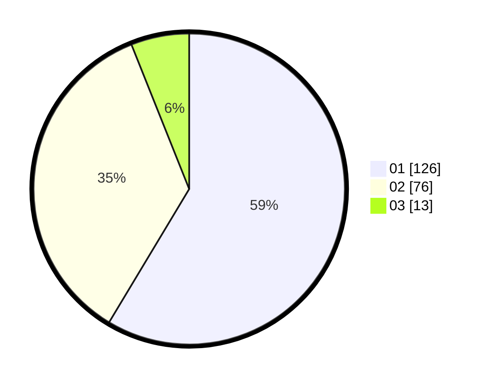

# Hasil

Hasil perolehan suara paslon dapat dilihat pada file paslon-01.txt, paslon-02.txt, dan paslon-03.txt.

Jika tidak ada, artinya data tersebut belum ada pada SIREKAP.

## Perolehan Suara

 * Paslon 01: **126**.
 * Paslon 02: **76**.
 * Paslon 03: **13**.

## Foto C Plano

https://sirekap-obj-formc.kpu.go.id/57ab/pemilu/ppwp/31/75/07/10/07/3175071007019-20240214-205827--389aac59-a18e-4d39-8edf-b4fecfc4bcfd.jpg

https://sirekap-obj-formc.kpu.go.id/57ab/pemilu/ppwp/31/75/07/10/07/3175071007019-20240214-211838--43faaea1-bfa6-4a5d-962a-bf5240f71ed1.jpg

https://sirekap-obj-formc.kpu.go.id/57ab/pemilu/ppwp/31/75/07/10/07/3175071007019-20240214-212008--ef8ca4c9-5d1b-4210-acc6-ffccf63a6ad4.jpg
