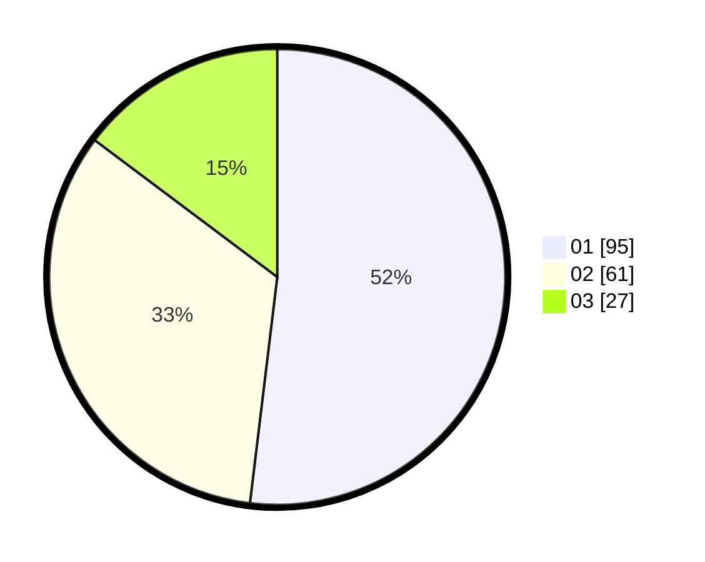

# Hasil

Hasil perolehan suara paslon dapat dilihat pada file paslon-01.txt, paslon-02.txt, dan paslon-03.txt.

Jika tidak ada, artinya data tersebut belum ada pada SIREKAP.

## Perolehan Suara

 * Paslon 01: **95**.
 * Paslon 02: **61**.
 * Paslon 03: **27**.

## Foto C Plano

https://sirekap-obj-formc.kpu.go.id/9d23/pemilu/ppwp/31/75/07/10/07/3175071007024-20240215-213632--db7d000d-8105-4b7b-9536-097a34302bd3.jpg

https://sirekap-obj-formc.kpu.go.id/9d23/pemilu/ppwp/31/75/07/10/07/3175071007024-20240215-213634--3771e68a-5b71-496b-ac42-acdbe78a4637.jpg

https://sirekap-obj-formc.kpu.go.id/9d23/pemilu/ppwp/31/75/07/10/07/3175071007024-20240215-213633--e41e7c1d-a62a-446f-87aa-bbee57a51059.jpg

## DATA PEMILIH TETAP

Jumlah pemilih dalam DPT: **262**.
 * L: **136**.
 * P: **126**.

## DATA PENGGUNA HAK PILIH

Jumlah pengguna hak pilih dalam DPT: **188**.
 * L: **93**.
 * P: **95**.

Jumlah pengguna hak pilih dalam DPTb: **4**.
 * L: **3**.
 * P: **1**.

Jumlah pengguna hak pilih dalam DPK: **0**.
 * L: **0**.
 * P: **0**.

Jumlah pengguna hak pilih: **192**.
 * L: **96**.
 * P: **96**.

## JUMLAH SUARA SAH DAN TIDAK SAH

JUMLAH SELURUH SUARA SAH: **183**.

JUMLAH SUARA TIDAK SAH: **9**.

JUMLAH SELURUH SUARA SAH DAN SUARA TIDAK SAH: **192**.
