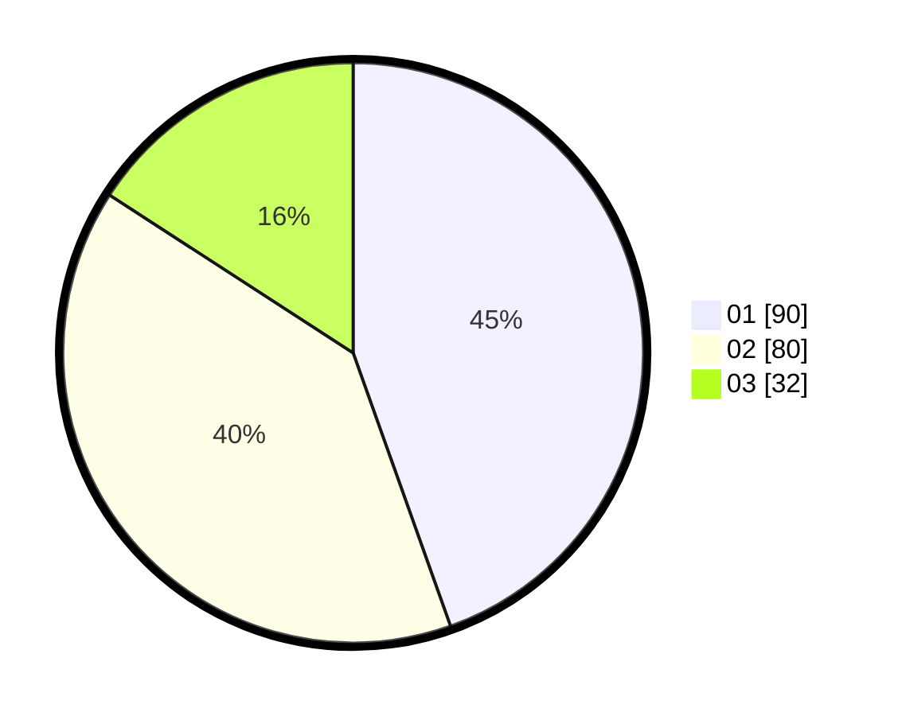

# Hasil

Hasil perolehan suara paslon dapat dilihat pada file paslon-01.txt, paslon-02.txt, dan paslon-03.txt.

Jika tidak ada, artinya data tersebut belum ada pada SIREKAP.

## Perolehan Suara

 * Paslon 01: **90**.
 * Paslon 02: **80**.
 * Paslon 03: **32**.

## Foto C Plano

https://sirekap-obj-formc.kpu.go.id/6b5a/pemilu/ppwp/31/75/07/10/07/3175071007026-20240216-143500--c5f09f71-b13f-4970-bec2-7b1f64da2f85.jpg

https://sirekap-obj-formc.kpu.go.id/6b5a/pemilu/ppwp/31/75/07/10/07/3175071007026-20240216-143502--b313163b-2cde-4662-b57a-f900a705ac0e.jpg

https://sirekap-obj-formc.kpu.go.id/6b5a/pemilu/ppwp/31/75/07/10/07/3175071007026-20240216-143501--05b8b515-4d15-4a03-9e57-6e6bf0e17e2b.jpg

## DATA PEMILIH TETAP

Jumlah pemilih dalam DPT: **263**.
 * L: **138**.
 * P: **125**.

## DATA PENGGUNA HAK PILIH

Jumlah pengguna hak pilih dalam DPT: **205**.
 * L: **104**.
 * P: **101**.

Jumlah pengguna hak pilih dalam DPTb: **0**.
 * L: **0**.
 * P: **0**.

Jumlah pengguna hak pilih dalam DPK: **2**.
 * L: **1**.
 * P: **1**.

Jumlah pengguna hak pilih: **207**.
 * L: **105**.
 * P: **102**.

## JUMLAH SUARA SAH DAN TIDAK SAH

JUMLAH SELURUH SUARA SAH: **202**.

JUMLAH SUARA TIDAK SAH: **5**.

JUMLAH SELURUH SUARA SAH DAN SUARA TIDAK SAH: **207**.
