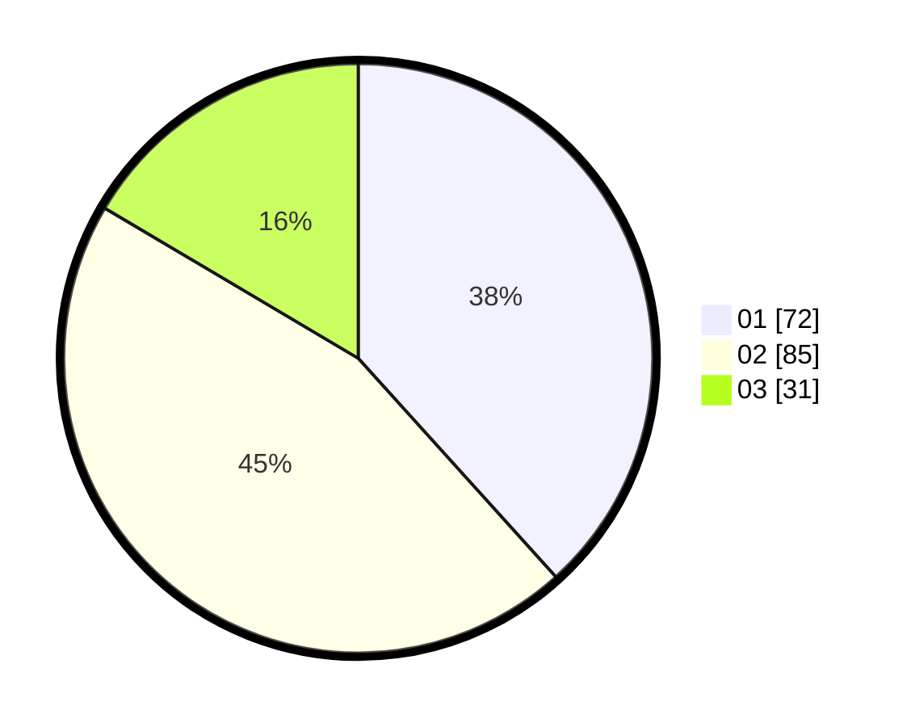

# Hasil

Hasil perolehan suara paslon dapat dilihat pada file paslon-01.txt, paslon-02.txt, dan paslon-03.txt.

Jika tidak ada, artinya data tersebut belum ada pada SIREKAP.

## Perolehan Suara

 * Paslon 01: **72**.
 * Paslon 02: **85**.
 * Paslon 03: **31**.

## Foto C Plano

https://sirekap-obj-formc.kpu.go.id/7378/pemilu/ppwp/31/75/07/10/07/3175071007028-20240216-010600--a10b86e2-8b97-40c8-8b6b-6792c8c8ec68.jpg

https://sirekap-obj-formc.kpu.go.id/7378/pemilu/ppwp/31/75/07/10/07/3175071007028-20240216-010604--47c0b55f-6276-4128-b573-43849c2334bc.jpg

https://sirekap-obj-formc.kpu.go.id/7378/pemilu/ppwp/31/75/07/10/07/3175071007028-20240216-010601--a7f48620-f9ca-43ba-8ffb-c4895d01dc11.jpg

## DATA PEMILIH TETAP

Jumlah pemilih dalam DPT: **264**.
 * L: **133**.
 * P: **131**.

## DATA PENGGUNA HAK PILIH

Jumlah pengguna hak pilih dalam DPT: **184**.
 * L: **89**.
 * P: **95**.

Jumlah pengguna hak pilih dalam DPTb: **6**.
 * L: **2**.
 * P: **4**.

Jumlah pengguna hak pilih dalam DPK: **0**.
 * L: **0**.
 * P: **0**.

Jumlah pengguna hak pilih: **190**.
 * L: **91**.
 * P: **99**.

## JUMLAH SUARA SAH DAN TIDAK SAH

JUMLAH SELURUH SUARA SAH: **188**.

JUMLAH SUARA TIDAK SAH: **2**.

JUMLAH SELURUH SUARA SAH DAN SUARA TIDAK SAH: **190**.
