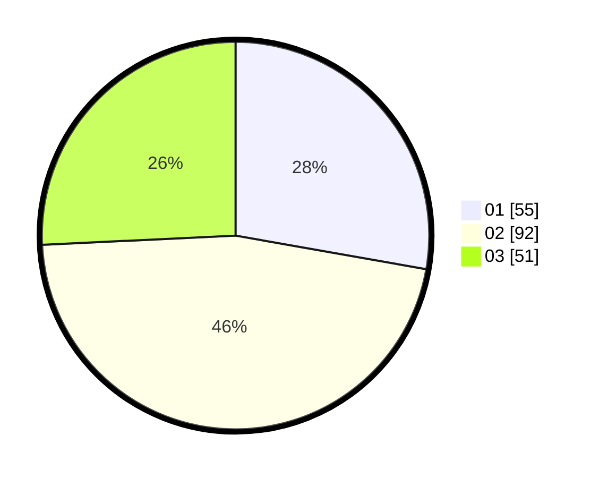

# Hasil

Hasil perolehan suara paslon dapat dilihat pada file paslon-01.txt, paslon-02.txt, dan paslon-03.txt.

Jika tidak ada, artinya data tersebut belum ada pada SIREKAP.

## Perolehan Suara

 * Paslon 01: **55**.
 * Paslon 02: **92**.
 * Paslon 03: **51**.

## Foto C Plano

https://sirekap-obj-formc.kpu.go.id/3b97/pemilu/ppwp/31/75/07/10/07/3175071007029-20240216-024235--1e5353ad-bf7e-4c81-950c-e5e3a89a4ab8.jpg

https://sirekap-obj-formc.kpu.go.id/3b97/pemilu/ppwp/31/75/07/10/07/3175071007029-20240216-024237--97e2f08b-3e7f-4bbf-b1e5-ff9a0bb3e12d.jpg

https://sirekap-obj-formc.kpu.go.id/3b97/pemilu/ppwp/31/75/07/10/07/3175071007029-20240216-024236--791530f6-c3f7-4b8b-b1cc-e9d8d1cad52f.jpg

## DATA PEMILIH TETAP

Jumlah pemilih dalam DPT: **258**.
 * L: **129**.
 * P: **129**.

## DATA PENGGUNA HAK PILIH

Jumlah pengguna hak pilih dalam DPT: **199**.
 * L: **100**.
 * P: **99**.

Jumlah pengguna hak pilih dalam DPTb: **0**.
 * L: **0**.
 * P: **0**.

Jumlah pengguna hak pilih dalam DPK: **2**.
 * L: **1**.
 * P: **1**.

Jumlah pengguna hak pilih: **0**.
 * L: **0**.
 * P: **0**.

## JUMLAH SUARA SAH DAN TIDAK SAH

JUMLAH SELURUH SUARA SAH: **198**.

JUMLAH SUARA TIDAK SAH: **2**.

JUMLAH SELURUH SUARA SAH DAN SUARA TIDAK SAH: **200**.
