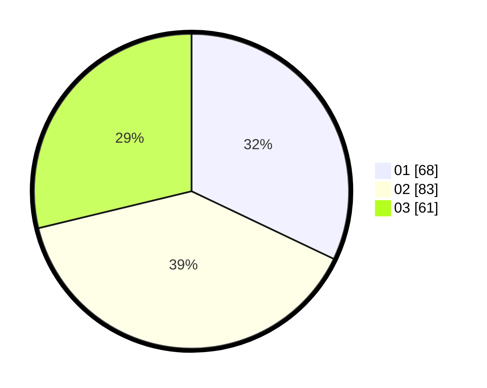

# Hasil

Hasil perolehan suara paslon dapat dilihat pada file paslon-01.txt, paslon-02.txt, dan paslon-03.txt.

Jika tidak ada, artinya data tersebut belum ada pada SIREKAP.

## Perolehan Suara

 * Paslon 01: **68**.
 * Paslon 02: **83**.
 * Paslon 03: **61**.

## Foto C Plano

https://sirekap-obj-formc.kpu.go.id/debc/pemilu/ppwp/31/75/07/10/07/3175071007031-20240214-200559--e923bf93-9439-465c-abc2-9066133f1e86.jpg

https://sirekap-obj-formc.kpu.go.id/debc/pemilu/ppwp/31/75/07/10/07/3175071007031-20240215-000001--b8c287da-d1d0-458e-84be-723f5960a08b.jpg
