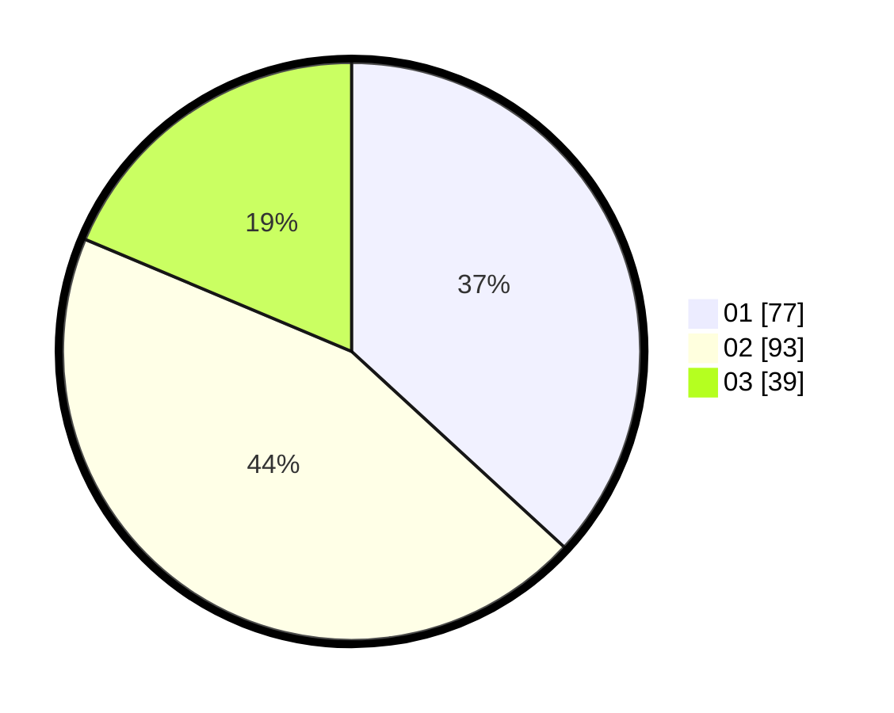

# Hasil

Hasil perolehan suara paslon dapat dilihat pada file paslon-01.txt, paslon-02.txt, dan paslon-03.txt.

Jika tidak ada, artinya data tersebut belum ada pada SIREKAP.

## Perolehan Suara

 * Paslon 01: **77**.
 * Paslon 02: **93**.
 * Paslon 03: **39**.

## Foto C Plano

https://sirekap-obj-formc.kpu.go.id/b78d/pemilu/ppwp/31/75/07/10/07/3175071007032-20240216-144303--d6292371-21ec-4d6a-91ff-f7dca80bc334.jpg

https://sirekap-obj-formc.kpu.go.id/b78d/pemilu/ppwp/31/75/07/10/07/3175071007032-20240216-144305--2094e980-b042-49bb-99c3-64a1c59c01fb.jpg

https://sirekap-obj-formc.kpu.go.id/b78d/pemilu/ppwp/31/75/07/10/07/3175071007032-20240216-144304--da05db84-66e5-4c99-8abf-6b70276a08a2.jpg

## DATA PEMILIH TETAP

Jumlah pemilih dalam DPT: **263**.
 * L: **141**.
 * P: **122**.

## DATA PENGGUNA HAK PILIH

Jumlah pengguna hak pilih dalam DPT: **211**.
 * L: **104**.
 * P: **107**.

Jumlah pengguna hak pilih dalam DPTb: **5**.
 * L: **2**.
 * P: **3**.

Jumlah pengguna hak pilih dalam DPK: **0**.
 * L: **0**.
 * P: **0**.

Jumlah pengguna hak pilih: **216**.
 * L: **106**.
 * P: **110**.

## JUMLAH SUARA SAH DAN TIDAK SAH

JUMLAH SELURUH SUARA SAH: **209**.

JUMLAH SUARA TIDAK SAH: **7**.

JUMLAH SELURUH SUARA SAH DAN SUARA TIDAK SAH: **216**.
