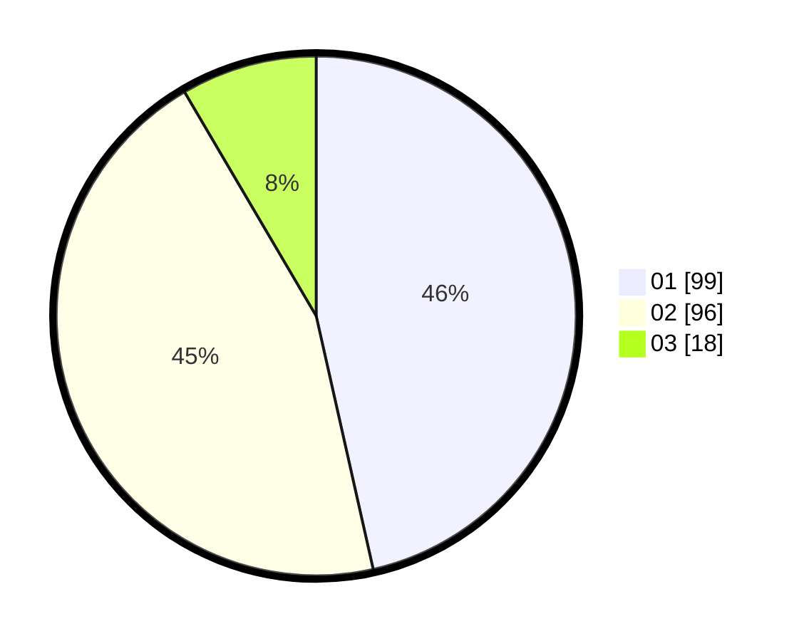

# Hasil

Hasil perolehan suara paslon dapat dilihat pada file paslon-01.txt, paslon-02.txt, dan paslon-03.txt.

Jika tidak ada, artinya data tersebut belum ada pada SIREKAP.

## Perolehan Suara

 * Paslon 01: **99**.
 * Paslon 02: **96**.
 * Paslon 03: **18**.

## Foto C Plano

https://sirekap-obj-formc.kpu.go.id/20c5/pemilu/ppwp/31/75/07/10/07/3175071007037-20240216-010851--6fdacb39-7aaa-4088-a406-871ecca41d64.jpg

https://sirekap-obj-formc.kpu.go.id/20c5/pemilu/ppwp/31/75/07/10/07/3175071007037-20240216-010855--ae3c6f76-3652-4989-a3a6-b1a17ff8c6ea.jpg

https://sirekap-obj-formc.kpu.go.id/20c5/pemilu/ppwp/31/75/07/10/07/3175071007037-20240216-010853--16abe6ff-832b-45a3-ae2c-327a742f1384.jpg

## DATA PEMILIH TETAP

Jumlah pemilih dalam DPT: **261**.
 * L: **122**.
 * P: **139**.

## DATA PENGGUNA HAK PILIH

Jumlah pengguna hak pilih dalam DPT: **213**.
 * L: **94**.
 * P: **119**.

Jumlah pengguna hak pilih dalam DPTb: **0**.
 * L: **0**.
 * P: **0**.

Jumlah pengguna hak pilih dalam DPK: **2**.
 * L: **1**.
 * P: **1**.

Jumlah pengguna hak pilih: **215**.
 * L: **95**.
 * P: **120**.

## JUMLAH SUARA SAH DAN TIDAK SAH

JUMLAH SELURUH SUARA SAH: **213**.

JUMLAH SUARA TIDAK SAH: **2**.

JUMLAH SELURUH SUARA SAH DAN SUARA TIDAK SAH: **215**.
