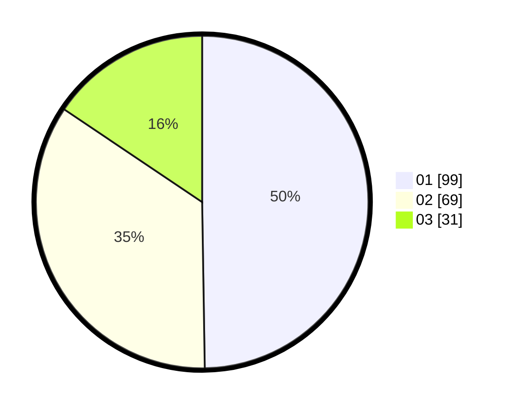

# Hasil

Hasil perolehan suara paslon dapat dilihat pada file paslon-01.txt, paslon-02.txt, dan paslon-03.txt.

Jika tidak ada, artinya data tersebut belum ada pada SIREKAP.

## Perolehan Suara

 * Paslon 01: **99**.
 * Paslon 02: **69**.
 * Paslon 03: **31**.

## Foto C Plano

https://sirekap-obj-formc.kpu.go.id/3fae/pemilu/ppwp/31/75/07/10/07/3175071007041-20240215-225122--598bcd64-d7b4-44f5-8916-462fadee3d79.jpg

https://sirekap-obj-formc.kpu.go.id/3fae/pemilu/ppwp/31/75/07/10/07/3175071007041-20240215-225125--d718f40c-4ee2-4f6a-a98e-2b0e376bc04f.jpg

https://sirekap-obj-formc.kpu.go.id/3fae/pemilu/ppwp/31/75/07/10/07/3175071007041-20240215-225123--c01ee989-5fa3-4fdb-8145-41f8401abc5f.jpg

## DATA PEMILIH TETAP

Jumlah pemilih dalam DPT: **261**.
 * L: **142**.
 * P: **119**.

## DATA PENGGUNA HAK PILIH

Jumlah pengguna hak pilih dalam DPT: **202**.
 * L: **107**.
 * P: **95**.

Jumlah pengguna hak pilih dalam DPTb: **0**.
 * L: **0**.
 * P: **0**.

Jumlah pengguna hak pilih dalam DPK: **0**.
 * L: **0**.
 * P: **0**.

Jumlah pengguna hak pilih: **202**.
 * L: **107**.
 * P: **95**.

## JUMLAH SUARA SAH DAN TIDAK SAH

JUMLAH SELURUH SUARA SAH: **119**.

JUMLAH SUARA TIDAK SAH: **3**.

JUMLAH SELURUH SUARA SAH DAN SUARA TIDAK SAH: **122**.
